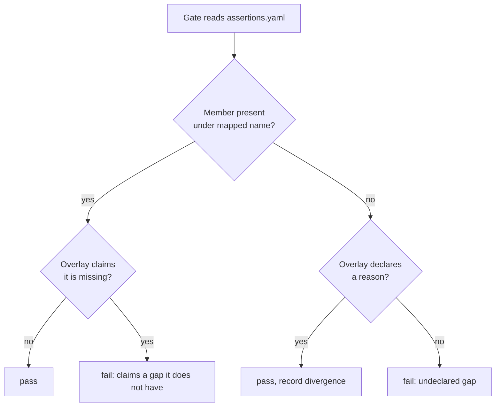

# RFC-0001: The standardized assertion set

## Summary

Define one set of test assertions as data, and implement it in Go, Java,
PHP, Python, Rust and TypeScript. This repository holds the definition:
a table of assertions, a table of names, and a corpus of cases. Each
library reads all three and runs the corpus in its own CI. A library that
omits an assertion, names one wrongly, or disagrees with the corpus about
what an assertion means fails its build.

## Motivation

Write the same test twice, once in Python and once in Go, and the two
should pass or fail together. Today they do not, and the reason is that
each language's assertion library made its own choices about the cases
nobody writes down.

Take one case. Go's `cmp` package, configured the way most Go test
helpers configure it, says a nil slice equals an empty slice. Python says
`None` does not equal `[]`. A team that ports a test suite from one to
the other gets a green build in both, testing two different things. The
difference shows up months later as a bug that reproduces in one service
and not its rewrite.

Six libraries written from a prose specification drift the same way, and
the drift stays invisible because each library's own tests pass. Each
team tests what it believes the specification says. Nothing tests whether
the six beliefs agree.

The fix belongs here rather than in each library because agreement is not
a property any one library can have. A library can be correct on its own
terms and still disagree with its five siblings. Only a shared artifact,
read by all six, can catch that, and the artifact has to be data rather
than prose because prose does not fail a build.

## Detailed design

### Assertions have IDs, names come from a table

An assertion has a canonical ID that no user types. Each language maps
that ID to a name its users recognise.

```yaml
# assertions.yaml — what an assertion means
throws:
  arity: 2                      # callable, msg
  summary: The callable raises. Yields what was raised.
  message_fields: [got]
```

```yaml
# naming.yaml — what a user types
throws:
  go:         Panics
  java:       assertThrows
  php:        expectException
  python:     raises
  rust:       panics
  typescript: toThrow
```

A single shared vocabulary would read as a translation in five of the six
languages. Splitting the ID from the name lets a Python developer write
`raises` and a Go developer write `Panics` while both are held to one
definition.

### What belongs in the set

Two questions decide whether something belongs here. Both must answer
yes, and the second is the one people get wrong.

**Does it state something that must be true, and fail when it is not?**
An assertion checks. A fake clock, a seeded random source, an injected
fault and a test double do not: they supply an input, so a test can
reach the state worth checking. They are the other half of writing a
test and they are not this. A tool that reads source and writes tests
is a third thing again.

**Does it mean the same thing in every target language?** `equal` does.
A golden file does. A latency ceiling does. Anything defined in terms of
one language's machinery does not, and cannot be one definition
implemented six times however useful it is.

Applied to the boundary cases:

| Included | Why |
|---|---|
| Golden files | A file of expected output means the same thing everywhere |
| Benchmark ceilings | A ceiling on latency is a check, and latency is universal |
| `rejects` | It checks that a check can fail |

| Excluded | Why |
|---|---|
| Controllable time, randomness and faults | They supply inputs rather than check outcomes |
| Test doubles | Idioms differ too far to be one definition |
| Anything reading a language's type system | Cannot be implemented six times |

An assertion that passes both questions but whose arguments are not
data is still in the set. It is checked for presence and tested by each
language; see *Conformance*. Being hard to write a case for is not the
same as being out of scope.

### The set

Every assertion is required. A language that cannot implement one
declares it; see *Conformance*.

**Values.** `equal`, `not-equal`, `true`, `false`, `nil`, `not-nil`,
`length`, `empty`, `not-empty`, `contains`, `not-contains`,
`contains-in-order`, `has-prefix`, `has-suffix`, `matches`, `close-to`,
`in-range`, `pairwise`.

`matches` takes a regular expression, and a pattern that does not compile
fails the assertion rather than raising. `close-to` compares within a
tolerance: `abs(got - want) <= tolerance`. `in-range` takes a closed
interval. `pairwise` takes a predicate and applies it to each adjacent
pair, so a list of timestamps can be checked for ascending order.

**Errors and panics.** `err-absent`, `err-present`, `err-is`,
`err-is-not`, `err-as`, `throws`, `not-throws`.

Two failure models exist across the six languages. Go and Rust return a
failure value; Java, PHP, Python and TypeScript raise. Go and Rust also
have panics. The `err-*` assertions take a failure value, and in the
raising languages they take an exception object the caller already
caught. `throws` and `not-throws` take a callable.

`err-is` walks the chain of wrapped causes. That chain is `errors.Is` in
Go, `getCause()` in Java, `source()` in Rust, `__cause__` in Python,
`getPrevious()` in PHP, and `.cause` in TypeScript. A chain that contains
a cycle must stop rather than loop.

**Behaviour.** `honours-cancellation`, `honours-deadline`,
`completes-within`, `pure`, `nil-context-safe`.

`honours-cancellation` calls the subject with a cancellation handle that
is already cancelled, and requires a cancellation failure back.
`honours-deadline` does the same with an expired deadline. `pure` reads
some observable state, calls the subject, reads the state again, and
requires the two readings to be equal. `nil-context-safe` passes an
absent cancellation handle and requires the subject not to crash.

**Waiting.** `eventually`, `eventually-true`, `no-task-leaks`.

`eventually` re-runs an assertion body at a fixed interval until it
passes or the timeout expires, and on timeout reports the last failure.
`eventually-true` re-runs a predicate with exponential backoff and on
timeout reports the timeout. They stay separate because they fail
differently, and a caller picks by which failure they want to read.

**Golden files.** `golden-match`, `golden-match-at`,
`golden-match-json-field`.

`golden-match` resolves a name against the language's conventional
directory. `golden-match-at` takes a path as given. `golden-match-json-field`
compares one named field of a JSON object, so several independent values
can share one file. Each library documents how a caller updates a golden
file in place.

**Benchmarks.** `bench-max-latency`, `bench-max-mean`,
`bench-max-allocs`, `bench-max-bytes`.

**Proof.** `rejects`.

`rejects` runs a check against an implementation the check is supposed to
reject, and fails if the check passes. Without it, a check whose every
statement is `err-absent` passes against a subject whose methods do
nothing and return null. That check reads as coverage and tests nothing.
`rejects` returns the failure message, so a caller can assert the check
failed for the reason it was written to catch.

### Both call styles, with the same names

Every assertion exists as a function and as a method on a chain, under
the name the naming table gives:

```
Equal(seat, got, want, msg)
That(seat, got).Equal(want, msg)
```

The chain entry point is named for "that" so the qualified call does not
repeat the namespace.

Every assertion takes a message as its last argument, and the message is
required. Without it a failure reports what was observed. With it the
failure also reports what was supposed to be true, which is the part a
reader needs.

### Two namespaces: one aborts, one does not

Each library ships two namespaces holding the same members under the same
names. One aborts the test on failure. The other records the failure and
returns.

```
assert.Equal(seat, got, want, msg)   // stops the test
expect.Equal(seat, got, want, msg)   // records, keeps going
```

The recording namespace is what makes the chain worth having: it runs
every matcher and reports every failure, so a reader sees all of them at
once instead of fixing one and re-running.

The golden-file and benchmark assertions abort only. A test that
continues past a golden mismatch reports failures about data it already
knows is wrong.

### The seam

A library never calls the host test framework directly. It reports
through a seam with three operations: mark this frame as a helper, fail
and stop, fail and continue. The host framework's own test handle
satisfies it.

Each library also ships a recorder: a seat that captures the first
failure instead of aborting. An assertion library cannot test its own
assertions without one, because a failing assertion would abort the test
observing it. `rejects` drives its subject through a recorder.

### Equality

`equal` is the most used assertion, and its edge cases are where six
implementations disagree if nobody writes them down.

**A null collection does not equal an empty one.** `None` and `[]` are
different values in Python; so are `null` and `[]` in PHP and
TypeScript. A standard that equated them would make four libraries report
values they were not given. Callers who do not care about the difference
pass an option per call.

**No coercion.** `1` does not equal `"1"`, and `0` does not equal
`false`. The statically typed languages get this from their compilers.
The dynamically typed ones have to enforce it.

**NaN does not equal NaN**, following IEEE 754. An option per call
reverses it.

**Floats compare exactly.** `close-to` is the assertion that applies a
tolerance. An `equal` that quietly applied one would hide the bugs
`close-to` exists to tolerate.

**A cyclic structure stops rather than recursing.**

**Two references to the same function are equal. Two different functions
are not.**

**Fields compare as deeply as the language reaches without unsafe
access.** Go reads unexported fields through reflection. Rust cannot read
a private field outside its defining module. Java may be refused by the
module system. Each library documents where its limit falls, because
pretending the limit is the same everywhere is how a corpus case starts
passing for the wrong reason.

### What a failure says

The first line is the caller's message, unchanged. After that, each
assertion names specific values: `equal` shows a want and a got,
`length` shows both lengths, `contains-in-order` shows the index and the
needle it could not find. `assertions.yaml` lists the required fields per
assertion.

How a library renders those fields is its own business. Matching one
language's diff output byte for byte across all six would mean writing
five more diff engines, and the result would make each library's failures
look foreign in its own ecosystem.

### Conformance

Three mechanisms, because there are three ways to disagree.

**The completeness gate** catches a missing or misnamed assertion. Each
library reads `assertions.yaml` and `naming.yaml`, inspects its own
public surface, and fails when an assertion has no member under its
mapped name or the member takes the wrong number of arguments.

**The corpus** catches disagreement about meaning. Cases state their
values in an encoding each library turns into native values:

```json
{
  "id": "equal/null-list-vs-empty-list",
  "assertion": "equal",
  "got":  {"type": "list", "of": "int", "value": []},
  "want": {"type": "null"},
  "expect": "fail",
  "message_contains": ["want", "got"]
}
```

**Declared divergence** catches the gap between what a library cannot do
and what it has not done yet. This is why no assertion is marked
optional. Marking `bench-max-allocs` optional makes a language with no
allocation counter look identical to one whose author ran out of time.

Instead every assertion is required, and a library that cannot supply one
says so:

```json
{
  "extends": "spec://assertions@1.0.0",
  "language": "php",
  "diverge": [
    { "id": "bench-max-allocs",
      "stance": "blocked",
      "why": "PHP exposes no per-iteration allocation counter",
      "remedy": "none known" }
  ]
}
```

The gate then allows the assertion to be absent, requires the library's
own documentation to carry that reason where a reader finds it, and
records the divergence. An assertion missing without a matching entry
fails the build. An entry naming an assertion the library does implement
also fails the build, so a library cannot claim a gap it does not have.



`no-task-leaks`, the benchmark ceilings and the golden-file assertions
depend on runtime facilities the corpus cannot encode. The gate checks
they are present; each library tests their behaviour itself.

### Versioning

Each release of the definition gets a semantic version number. Each
library records the version it implements. A change that removes an assertion, renames one,
or changes what a corpus case expects is a major bump, and the libraries
sit on different versions until each catches up. The recorded version is
what makes that visible.

## Alternatives considered

### A. A prose specification, implemented by hand

Write the rules in Markdown and let each team implement them.

**Why not:** prose does not fail a build. Two teams read "empty is not
absent" and one of them still ships a library where `[]` equals `null`,
because their language's idiomatic comparison does that by default and
the specification did not force them to notice. The drift this proposal
exists to catch is exactly the drift a prose specification cannot catch.

### B. Generate each library's public surface from the definition

Emit signatures and doc comments per language, and hand-write only the
comparison logic.

**Why not:** it needs a code generator per language, six formatter
integrations, and a build step in every repository, for 41 assertions. The completeness gate gets the same guarantee about names and
arity from roughly 50 lines of reflection per language, with no generated
code to review.

### C. One implementation, five thin wrappers over it

Write the comparison logic once, in Rust or C, and bind the other five to
it.

**Why not:** it is the shape a project of this kind tends to end up in,
and for a good reason: one implementation cannot disagree with itself.
The cost is that every library gains a native build step and a binary
artifact per platform, which turns a test-only dependency into a
deployment concern. It also cannot express the per-language field
reachability rules above, because those are properties of the calling
language rather than of the comparison.

This is the strongest alternative. If declared divergence turns out not
to hold the six libraries together, this is what to try next.

### D. Pick one library as the reference and translate it

Build the Go library, then port it five times.

**Why not:** the definition then lives in Go's source, and the other five
read it by inference. Every question the Go implementation did not have
to answer, because Go's type system answered it, gets answered
differently five times.

## Drawbacks

**Six repositories to keep at one version.** A change to the definition
is a change to seven repositories: this one and the six that read it. A
major bump leaves the libraries at different versions until the last
catches up.

**The corpus tests what it states, and nothing else.** An assertion can
be wrong in a way no case covers. All 41 assertions need cases for their
edge conditions, and a case nobody wrote is a gap nobody sees.

**More than half the set is gate-checked but not corpus-checked.** A
case states its arguments as data, so it reaches only the assertions
whose arguments are data: 17 of the 41. The other 24 take a callable, a
cancellation handle, a predicate, a golden file or a benchmark, and rest
on per-language tests written to per-language judgement. An
implementation is held to the standard on meaning where meaning can be
stated, and on membership everywhere else.

**Two namespaces double the public surface.** Each namespace declares a
function per assertion, and a chain method for every assertion whose
first argument is the value being held. In Go that came to 34 functions
and 15 methods per namespace, so about 100 public members before
anything language-specific.

**Declared divergence is only as honest as the reviewer.** A library can
declare a divergence it could have implemented, and the gate cannot tell
the difference between "impossible" and "not attempted". People read the
reason field. CI does not check it.

## Open questions

- Should a recording-namespace chain report its accumulated failures when
  the chain ends, or leave them to the host framework to report at test
  end? The two differ in what a reader sees when a later assertion
  crashes.
- The encoding covers null, bool, int, float, string, bytes, list, map,
  struct, error and function references. Is that enough to state the
  equality edge cases above, or does field reachability need cases the
  encoding cannot express?
- How many consumers running two of the six libraries would justify this?
  If nobody runs two, one good library was the whole requirement.

## Unresolved and future work

Extending the set beyond these 41 assertions is not proposed here.

A cross-language view showing which library implements which assertion,
built from the recorded divergences, is not proposed here. The
divergences are recorded in a form that would support one.

## References

| What | Where |
|---|---|
| IEEE 754, NaN comparison | IEEE Std 754-2019 |
| Semantic Versioning 2.0.0 | https://semver.org/spec/v2.0.0.html |
