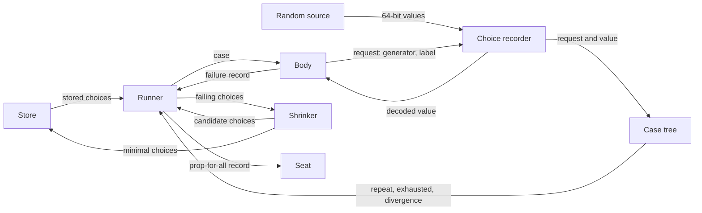
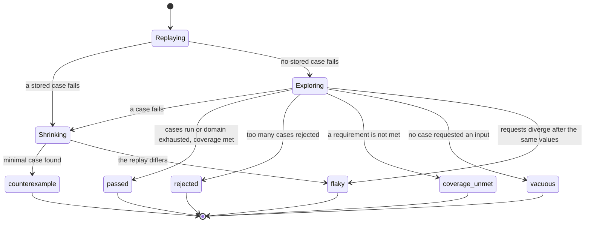

# RFC-0010: Properties over generated inputs

## Summary

This adds a property check to the standard. `prop-for-all` runs a body
against many generated inputs and fails with the smallest counterexample
it can find. The generators, the random source behind them, and the
search for a smaller counterexample are part of the definition, so the
same property tests the same inputs in every language. With the same
seed, a Go property and its Python port receive identical values, and a
failure shrinks to the same counterexample in both.

The engine is designed around five commitments:

- A test case is a sequence of typed choices with spans, so the shrinker
  edits whole values and whole structures rather than bits.
- A run replays stored failures and tries the simplest input and the
  boundary inputs first. It skips an input it has already tested, and it
  stops early once it has tested every input of a small domain.
- The shrinker keeps a different failure it finds as a second
  counterexample. The report lists the inputs of a counterexample that
  matter, and for an integer that matters, the nearest value that passes.
- A property that tested nothing fails instead of passing. A caller can
  require a share of the inputs to fall under a named label, and a body
  that requested no input is reported.
- Every random decision a body takes can come from the case, so
  randomised code under test replays and shrinks without change.

A run on more than one worker reports the same inputs, counterexample
and outcome as a run on one. Model-based tests, simulation and long
campaigns build on this engine in a separate proposal.

## Motivation

### The standard can state a relation but not the inputs to drive it with

The relation family states properties such as `round-trip` and
`idempotent` about one input that the caller supplies. It was written
so that "the same relation can be asserted about one input or driven
over generated ones". The standard has no generators, so the second
half of that sentence means whichever property-testing library each
language has. Those libraries disagree on every question that decides
what a property tested:

| Question | What the libraries do |
|---|---|
| How many inputs a run tries | 100 in Hypothesis, fast-check, QuickCheck and rapid. 256 in proptest. 1,000 in jqwik and Kotest |
| Which inputs come first | Hypothesis replays stored failures, then tries the simplest input. jqwik mixes edge cases into random generation, and generates exhaustively when the domain has at most 1,000 values. Kotest replaces 2% of samples with edge cases. fast-check biases values towards small and extreme ones, more often early in a run |
| What a smaller counterexample means | Hypothesis reduces the recorded sequence of choices. fast-check, proptest, jqwik and Kotest shrink a value through the generator that produced it. QuickCheck applies a shrink function declared per type |
| How a failure is reproduced | A seed in proptest and Kotest. A seed and a size in QuickCheck. A seed and a path through the shrink in fast-check. A seed, the index of the failing try and the shrink's steps in jqwik. A fail file of the recorded data, or the seed, in rapid. A blob that only the Hypothesis release that printed it accepts |
| Where a found failure is kept | A directory database in Hypothesis. A file of seeds beside each source file in proptest, meant to be committed. One file in jqwik that each run rewrites. A seed file per test in Kotest, deleted when the test passes. Fail files under `testdata` in rapid. Nowhere in fast-check and QuickCheck |

A property ported from Go to Python explores a different domain and
shrinks to a different counterexample. It also keeps its failures in a
different format. Both builds can be green while they test different
things. That is the drift this standard exists to catch, and the corpus
cannot catch it, because nothing in the corpus describes a generator.

Hegel, which Hypothesis's maintainers released in 2026, runs one engine
under libraries for Rust, Go, C++, TypeScript, Java and OCaml. That
removes the differences that come from the engine for those six
languages. Each library still composes its own generators from the
engine's draws, and Hegel states no agreement between the values two of
its libraries produce from one seed.

### Property-based testing is the main competitor, and Go is the outlier

Research on adoption found property-based testing libraries among the
most downloaded test libraries in the standard's ecosystems. In August
2026, fast-check recorded 137 million npm downloads in a month,
Hypothesis 50 million on PyPI, and proptest 177 million in total on
crates.io. Go is the outlier: its largest property-testing library has
871 GitHub stars.

The same research could not establish whether Go's small adoption is a
gap or a preference for Go's native fuzzing. This proposal serves both
readings. A property check designed to Hypothesis's standard fills the
gap. The fuzz bridge runs the same property under `go test -fuzz`. In
the other five languages the property check offers something no library
there documents: the same property, the same inputs and the same
counterexample in every language.

### Why here rather than in each library

A property check is an assertion. It states that a body is true for
every input in a domain, and it fails with a counterexample when it is
not. The domain is part of what the assertion means: `for-all` over
integers from 0 to 10 and `for-all` over all 64-bit integers are
different claims. So the generators belong in the definition for the
same reason the clock does. A relation stated against each platform's
own facility means something different in each language, and the corpus
can never check it.

## Detailed design

### Terms

| Term | Meaning |
|---|---|
| Property | A body that a run calls once per generated input |
| Generator | A description of a domain, and of how to decode a value from choices |
| Choice | One typed decision a generator makes: an integer, a float or a sequence, within bounds |
| Case | One call of the body, with the sequence of choices it consumed |
| Counterexample | The values a failing case decoded, in the order the body requested them |
| Shrinking | The search for a smaller case that fails the same way |
| Case tree | The record of every choice sequence a run generated |
| Store | The files that keep minimal failing cases between runs |

### Components

| Component | Responsibility |
|---|---|
| Random source | Produces a 64-bit stream from a seed, the same in every language |
| Choice recorder | Records each choice a case makes, with its bounds and its span |
| Generators | Decode values from choices; the vocabulary is fixed |
| Case tree | Finds a repeated case, an exhausted domain and a body whose requests diverge |
| Runner | Runs the phases on one or more workers, counts cases and rejections, decides the outcome |
| Shrinker | Searches for a shortlex-smaller choice sequence with the same failure |
| Store | Reads and writes minimal failing choice sequences per property |
| Fuzz bridge | Decodes a fuzzer's bytes into choices and runs one case |



### One property in four languages

The same property in Go, Python, TypeScript and Rust:

```go
func TestRoundTrip(t *testing.T) {
	prop.ForAll(t, "decoding undoes encoding", func(c *prop.Case) {
		v := c.Draw(prop.List(prop.Integer[int64](-1000, 1000), prop.MaxSize(16)), "values")
		got, err := Decode(Encode(v))
		assert.NoError(c, err, "decoding succeeds")
		assert.Equal(c, got, v, "decoding returns the encoded values")
	})
}
```

```python
from dokimi_assert import equal, prop


def test_round_trip(seat):
    def body(case):
        v = case.draw(prop.list(prop.integer(-1000, 1000), max_size=16), "values")
        equal(case, decode(encode(v)), v, "decoding returns the encoded values")

    prop.for_all(seat, "decoding undoes encoding", body)
```

```typescript
import { check, prop } from "@dokimi/assert";
import { test } from "@dokimi/assert/vitest";

test("round trip", ({ seat }) => {
  prop.forAll(seat, "decoding undoes encoding", (c) => {
    const v = c.draw(prop.list(prop.integer(-1000, 1000), { maxSize: 16 }), "values");
    check.equal(c, decode(encode(v)), v, "decoding returns the encoded values");
  });
});
```

```rust
use dokimi_assert::{check, prop, seat::Collector};

#[test]
fn round_trip() {
    let seat = Collector::new();
    prop::for_all(&seat, "decoding undoes encoding", |c| {
        let v = c.draw(&prop::list(prop::integer(-1000i64, 1000), 0..=16), "values");
        let got = decode(&encode(&v)).unwrap();
        check::equal(c, &got, &v, "decoding returns the encoded values");
    });
}
```

With the same seed, the four bodies receive the same lists in the same
order. A failure in each shrinks to the same list.

A body receives a case, and a case is a seat. Every assertion of the
standard works inside a body without change. An aborting assertion ends
the case. A recording one marks the case failed and lets the body
continue. The second argument is the contract of the property and the
first line of the failure, as for every other assertion.

### The assertion

```yaml
"prop-for-all":
  arity: 2
  package: prop
  summary: >
    A body passes for every input a run generates. A run replays the
    stored failures, tries the simplest input and the boundary inputs,
    then generates inputs it has not tested until it has run the stated
    number of cases or tested every input. A fixed sequence of passes
    shrinks a failing case towards the smallest case that fails the
    same way.
  detail_fields: [outcome, cases, rejected, seed, counterexample, failure, choices, others, divergence, coverage]
```

The required arguments are the contract and the body, in that order.
`rejects` puts its message before its callable for the same reason: a
body is the longest argument, and a message after it would be far from
the call. Options follow the body. They are optional in every language,
and the arity does not count them.

A failing property has already run its body many times, so
`prop-for-all` aborts only, as the golden-file and benchmark assertions
do.

A run ends in one of six outcomes. Every outcome except `passed` fails
the test.



| `outcome` | When | What the record names |
|---|---|---|
| `passed` | Every case passed and every coverage requirement was met. The run may stop early because it tested every input | Nothing; no record is reported |
| `counterexample` | A case failed, and replaying its choices fails the same way | The minimal case, its failure and its choices |
| `flaky` | A failing case passed or diverged on replay, or the body requested different choices after the same values | The case, its failure if any, and the divergence |
| `rejected` | The body rejected more than ten cases for every case it accepted | The counts |
| `coverage-unmet` | A coverage requirement was refuted or not confirmed | The requirement and the observed share |
| `vacuous` | Every case passed and no case requested an input | The number of cases |

A `rejected`, `coverage-unmet` or `vacuous` run found no counterexample
and still fails. A property that never ran its body on a valid input has
not passed. It has not been checked. A body that requested nothing ran
the same input in every case, which is one example run a hundred times.
The usual cause is a body that draws from another case than the one it
was given.

The detail of a failing run:

| Field | Value |
|---|---|
| `outcome` | One of the six names above |
| `cases` | The number of valid cases that ran |
| `rejected` | The number of cases the body rejected |
| `seed` | The seed of the run, as a decimal string |
| `counterexample` | The minimal case's draws in request order. Each has its label, its value, whether any value fails there, and for an integer, the nearest value that passes |
| `failure` | The failing case's record, which has no `assertion` for a message passed to `fail` or `record`, or the error the body raised |
| `choices` | The replay token of the minimal case |
| `others` | The other distinct failures, each with its own counterexample, failure and choices |
| `divergence` | For `flaky`: what differed first, a request, a fingerprint or the verdict, its position, and both versions. A verdict's position is the number of choices the case made |
| `coverage` | For `coverage-unmet`: the label, the required share, the cases the label counted, the valid cases, and the verdict |

A field the outcome does not use is null. Every field is present, so a
reader that knows the assertion knows the keys.

### The case

```text
Case                       a Seat, plus the members below
  draw(generator, label) -> value
      Decodes the next value from the case's choices and records it
      under label for the counterexample. Two draws may share a label.
      A draw may stop the body instead of returning, when the case
      repeats one the run has already tested.
  assume(condition)
      Rejects the case when condition is false. A rejected case is not
      counted, is not shrunk, and does not fail the property.
  classify(label)
      Counts this case under label. A label counted twice in one case
      counts once.
  note(message)
      Attaches message to this case. Only a failing case reports its
      notes.
  rand() -> random source
      Returns the language's own random-source interface, backed by the
      case. Every value it produces is an integer choice over the full
      64-bit range, so code written against the platform's random
      interface replays and shrinks without change.
  observe(fingerprint)
      Records a 64-bit fingerprint of the subject's state at this point.
      A replay compares its fingerprints with the recorded ones and
      reports the first that differs.
```

`rand()` returns `math/rand/v2.Source` in Go, a `random.Random` in
Python, a `java.util.random.RandomGenerator` on the JVM, and the trait
the Rust implementation states for a random source. TypeScript has no
standard interface, so it returns a function that produces the next
unsigned 64-bit value as a `bigint`.

`assume` and a draw that stops the body end the case with a signal of
the engine, an exception or a panic depending on the language. A body
must let that signal pass, as it must let an aborting assertion pass.

A case is safe for concurrent use, as every seat is. Assertions may
report to it from any thread. A body that starts threads still draws on
the thread that runs the body. Draws from more than one thread are
recorded in the order the scheduler gives them. A replay of those
choices then decodes other values.

The case returns the clock of the run's seat. Under a controlled clock,
every case of a property runs under that clock.

### Choices

A case is a sequence of choices. Each choice has a kind, bounds, and the
value the case used.

| Kind | Bounds | Value |
|---|---|---|
| `integer` | `lo` and `hi`, both inside the signed or both inside the unsigned 64-bit range | An integer in `[lo, hi]` |
| `float` | `lo` and `hi`, which may be infinite, whether NaN is allowed, and a width of 32 or 64 | A float of that width in `[lo, hi]`, or NaN |
| `sequence` | `k`, the number of element values, and `min_size` and `max_size` | Between `min_size` and `max_size` integers, each in `[0, k)` |

A boolean is an integer in `[0, 1]`. A string is a sequence of indices
into an alphabet, and a byte string is a sequence with `k` = 256, so a
string of 100 characters is one choice. A collection of other values is
a run of continue-or-stop integers with each element's choices between
them. A sequence counts as one choice towards the limit of 8,192, plus
one for each element.

A sequence keeps the elements of a string or a byte string next to each
other. The fuzz bridge then maps a fuzzer's bytes onto those elements one
to one, which matters because a fuzzer mutates contiguous bytes.
Hypothesis has separate string and bytes kinds. One kind with a
parameter covers both here.

Every choice has a target, the simplest value its bounds allow:

- An integer's target is the value in `[lo, hi]` closest to zero. A tie
  goes to the positive value.
- A float's target is the value in `[lo, hi]` with the smallest sort
  key.
- A sequence's target is `min_size` zeros.

Choices are ordered by a sort key, and a smaller key is a simpler value:

- An integer's key is `(|v − target|, 1 if v < target else 0)`. Values
  closer to the target are simpler, and above the target is simpler than
  below at equal distance.
- A float's key orders these groups, from simplest:
  1. Integral values whose magnitude is below 2^53, by magnitude.
  2. Other finite values, by the number of fractional bits and then by
     the numerator over that power of two.
  3. The infinities.
  4. NaN.

  Within a group, a positive value is simpler than the negative value of
  equal magnitude, and +0 is simpler than −0.
- A sequence's key is its length, then its elements in order. A shorter
  sequence is simpler, and of two sequences of equal length, the simpler
  has the smaller element where they first differ.

A case is smaller than another when its choice sequence is shorter, or
equally long and smaller in the first choice where the two differ. This
is shortlex order over the keys, and it is the only order the shrinker
uses.

Each choice belongs to the spans of the generators that requested it.
A span is labelled with the generator's id. Each list element and each
dict entry is also a span, labelled `element` or `entry`, that starts at
the continue integer before it. The shrinker can then delete or move an
element, an entry or a step of a machine whole.

### Replaying choices

A case is either generated from the random source or replayed from a
recorded sequence. A replayed choice of another kind than the generator
now requests, or whose value is outside the bounds it now requests,
takes the target of those bounds instead. A replayed sequence longer
than `max_size` is cut to `max_size`, a shorter one than `min_size` is
extended with zeros, and an element outside `[0, k)` becomes 0. A
replay that runs out of recorded choices takes the target for every
further request. A case may make at most 8,192 choices, and a case that
requests more is rejected as too large.

These two rules make every prefix of a recorded sequence a valid case,
and they make every edit the shrinker tries a valid case. An engine that
treated a replay that runs out of data as invalid would discard every
candidate that deletes the tail of a case.

### Generators

The corpus states a generator as a JSON object, and each implementation
turns that object into its native generator:

```json
{ "gen": "list",
  "of": { "gen": "integer", "min": -1000, "max": 1000 },
  "min_size": 0, "max_size": 16 }
```

The vocabulary:

| Id | Parameters | Choices it makes | Value from the targets |
|---|---|---|---|
| `integer` | `min`, `max` | One integer in `[min, max]` | The value closest to zero |
| `float` | `min`, `max`, `allow_nan`, `width` | One float | The simplest float in range |
| `boolean` | `p`, a rational as `[numerator, denominator]`, 1/2 by default | One integer in `[0, 1]`, drawn by one `coin` of `p` in lowest terms | `false` |
| `just` | `value` | None | `value` |
| `sampled-from` | `values`, non-empty | One integer index | The first value |
| `one-of` | `of`, non-empty | One integer index, then the chosen generator's choices | The first generator's simplest value |
| `optional` | `of` | One integer in `[0, 1]`, then the value's choices when present | Absent |
| `list` | `of`, `min_size`, `max_size`, `unique` | Per element a continue integer then the element; a final stop integer | `min_size` simplest elements |
| `dict` | `keys`, `values`, `min_size`, `max_size` | As a unique `list`, over entries, compared by key | `min_size` simplest entries |
| `string` | `alphabet`, `min_size`, `max_size` | One sequence of indices into the alphabet | `min_size` copies of the alphabet's first character |
| `bytes` | `min_size`, `max_size` | One sequence with `k` = 256 | `min_size` zero bytes |
| `duration` | `min`, `max`, in nanoseconds | One integer in `[min, max]` | The duration closest to zero |
| `permutation` | `values` | One integer per swap position | `values` in their given order |
| `string-matching` | `pattern`, from the portable subset | Per alternation of two or more branches, an index that decides structure; per quantifier, a continue integer before each repetition; per class, an index over its members | The first branch of each alternation, the fewest repetitions, and the simplest character of each class |
| `recursive` | `base`, `extend`, `max_leaves`, at least 1 and 100 by default | `one-of` between the base and an extension; once a value has drawn `max_leaves` values from the base, every further position takes the base | The base's simplest value |

TypeScript's `integer` has two overloads. Bounds given as numbers return
numbers and must be safe integers, so a bound beyond ±(2^53 − 1) fails
when the generator is built. Bounds given as bigints return bigints. The
choices are the same for both, so the overload changes the value's type
and not the case.

`recursive` bounds a value by its leaves, as Hypothesis's `recursive`
does with the same default of 100. A bound on depth would let a value
grow by the branching factor at every level. Inside `extend`, the
generator `{"gen": "self"}` is one position of the value being decoded.

A unique `list` discards an element equal to an earlier element, and a
`dict` discards an entry whose key equals an earlier key. Two values are
equal when they have the same type and the same value. Two dicts are
equal when they have equal entries, in any order. Floats compare by
their bits: −0 differs from +0, and every NaN is one value. After a
discard, the next continue integer is decided for the same count. Ten
discards in a row stop the collection. A collection still below
`min_size` at that point rejects the case. Its targets repeat, so the
simplest case of a unique collection with a `min_size` of 2 or more is
always rejected. A language API may also take a key function,
`unique_by`. It decodes the same choices and compares the keys.

The default alphabet is ordered so that its first characters are the
simplest: the digits `0` to `9`, the lowercase letters, the uppercase
letters, space and the printable ASCII punctuation, then every other
code point in the Basic Multilingual Plane except the surrogates, then
the code points above it. A string shrinks towards `"0"`, then `"00"`,
and never to a string a reader cannot type. A stated alphabet is a
non-empty string of Unicode scalar values that repeats no character. Its
first character is the simplest.

A `string-matching` pattern describes the whole string, so every string
it decodes matches the pattern in full. Its subset is what the regular
expression engines of every target language read the same way:

- A literal is any character but `\ . ^ $ | ? * + ( ) [ ] { }`, or one
  of those after a backslash.
- `.` is any character but `\n`, `\r`, U+0085, U+2028 and U+2029. Some
  engine's `.` matches none of these line terminators.
- `\d` is the ASCII digits. `\w` is the ASCII letters, the digits and
  the underscore. `\s` is space, `\t`, `\n`, `\f` and `\r`. Every
  engine's class contains these members.
- A class `[...]` contains characters, ranges and those three escapes,
  and a leading `^` negates it. Inside a class, `\`, `[`, `]` and a
  hyphen that does not form a range take a backslash. A hyphen may also
  come first or last. A class may not contain `&&`, `--`, `||` or `~~`. Java
  reads `&&` as an intersection, and other engines reserve the rest for
  set operations.
- A group is `(...)` or `(?:...)`, and `|` separates alternatives.
- The quantifiers are `*`, `+`, `?`, `{m}`, `{m,}` and `{m,n}`. A count
  is at most 1,000, the limit RE2 sets. A count of two or more digits
  does not start with `0`, because RE2 reads `x{007}` as literal text. A
  quantifier may not follow another quantifier. Lazy quantifiers such as
  `+?` are outside the subset for that reason.
- `^` may be the first character of the pattern and `$` its last.

Each implementation parses the subset itself, because two engines that
parse a pattern differently would decode different strings from the
same choices. A pattern outside the subset fails when the generator is
built, not when a case runs. A class chooses its character by an index
over its members in the order of the default alphabet, so `[A0a]`
shrinks to `0`. A quantifier decodes its repetitions as a collection
does, and each repetition is an `element` span.

Four combinators take a function:

| Id | What it does | Span |
|---|---|---|
| `map` | Applies a function to each value | The source generator's |
| `filter` | Tries up to three times in all while a predicate is false, then rejects the case | One per attempt; a rejected attempt is removed from the recorded sequence |
| `bind` | Chooses a second generator from the first value, then decodes from it | One span around both |
| `composite` | Runs a function that draws from other generators | One span around everything it draws |

Each attempt of a `filter` decodes afresh. A replay of the recorded
sequence decodes the kept value at the first attempt, because the
rejected attempts are no longer in the sequence. A replayed value that
the predicate rejects is read again by every attempt, so the replay
rejects the case. The choices of a rejected attempt still count towards
the cap of 8,192, and the case tree keeps them. A walk down the tree
cannot take a step back.

The corpus states `filter` as data, with `keep` one of the predicates
that the corpus bodies use:

```json
{ "gen": "filter",
  "of": { "gen": "integer", "min": 0, "max": 9 },
  "keep": { "kind": "divisible-by", "n": 2 } }
```

Its vectors then pin the attempts and the removals, which only a filter
makes. A language API takes any function of the value. The corpus does
not state `map`, `bind` or `composite`, because a function is their
whole content.

Deriving a generator from a language's types the same way in six
languages needs a language-neutral description of a type's shape. That
is a proposal of its own, and this one derives no generator from a type.

### Generating choices

The random source is the 64-bit three-rotate variant of Bob Jenkins's
small noncryptographic generator. It needs only addition, subtraction,
exclusive or and rotation, so JavaScript and PHP compute it exactly
without a 64-bit multiply. Its author placed it in the public domain.

```text
state a, b, c, d: u64, arithmetic modulo 2^64

init(seed):
  a = 0xf1ea5eed
  b = c = d = seed
  repeat 20 times: next()

next() -> u64:
  e = a - rotl(b, 7)
  a = b ^ rotl(c, 13)
  b = c + rotl(d, 37)
  c = d + e
  d = e + a
  return d
```

Case `i` of a run with seed `s` uses `init(s + i)`, with the addition
modulo 2^64. Every draw below uses integer arithmetic only, so the same
seed gives the same choices on every language and platform. A float
draw builds its value from integer bits and never calls a
transcendental function, because `log` and `exp` round differently
across libraries.

```text
below(n) -> integer in [0, n), for 1 <= n <= 2^64:
  if n == 1: return 0
  k = bit_length(n - 1)
  loop: u = next() >> (64 - k); if u < n: return u

coin(num, den) -> bool:        # probability num/den, both integers
  return below(den) < num

integer(lo, hi):               # target t
  if lo == hi: return lo
  if coin(1, 8): return edge(lo, hi, t)
  up = (t == lo) or (t != hi and coin(1, 2))
  span = up ? hi - t : t - lo
  cap = [2^4, 2^8, 2^16, 2^64][below(4)]
  offset = below(min(span, cap - 1) + 1)
  return up ? t + offset : t - offset

edge(lo, hi, t):
  values = distinct values of [t, lo, hi, t + 1, t - 1] that lie in [lo, hi]
  return values[below(len(values))]

size(min, max, average):       # a collection's length, decided one element at a time
  continue while count < min; stop at max
  otherwise continue with coin(average - min, average - min + 1)
```

A collection's average length is `min + min(max(min, 5), (max − min) / 2)`.
The division rounds up, so the average is an integer that `coin` can
use. Rounding down would give a collection of at most one element an
average length of zero. Its continue coin would then have odds of 0 in
1, and the random phase would generate the empty collection only.

A sequence decides its length with the same `size` rule and draws each
element with `integer(0, k − 1)`. A byte string consumes the stream
exactly as a list of integers in `[0, 255]` does. `float` follows the
structure of `integer`. One draw in eight takes an edge value, and three
in eight take an integral value. The other four assemble a sign, a
biased exponent and a mantissa from integer bits and clamp the result
into range. The executable reference states each draw exactly, and the
corpus pins the constants with vectors.

The `integer` and `duration` generators can repeat a value that their
case has already drawn with the same bounds:

```text
reusable(lo, hi):              # earlier: this case's reusable values with bounds [lo, hi]
  if lo != hi and earlier is not empty and coin(1, 4):
    v = earlier[below(len(earlier))]
  else:
    v = integer(lo, hi)
  append v to earlier
  return v
```

`earlier` contains only the values whose choices the case's recorded
sequence still contains. A `filter` removes a rejected attempt from that
sequence, and the attempt's values leave `earlier` with it, so a later
attempt never repeats a value the predicate rejected.

No other choice repeats a value. Structure choices, booleans, floats,
sequences, `rand()`, and the indices of `permutation` and
`string-matching` always take a new draw.

A bug in the code that handles two equal values fails only on a case
that contains them: a key inserted twice, a key deleted after it was
inserted, or two identifiers that collide. With reuse, the second of two
values with the same bounds equals the first in at least one case in
four. Without reuse, two values over the signed 64-bit range are equal
in one case in 155. Hypothesis produces such collisions with a mutator
instead. After a generated case, the mutator copies one span of the case
onto another span with the same label and runs the result as a further
case. Case `i` then depends on the cases before it, and a run on more
than one worker could no longer equal a run on one. Reuse inside one
case keeps case `i` a function of the seed and `i` alone.

The measurements before acceptance chose the odds of reuse, 1 in 4,
over 1 in 2 and 1 in 8. The other constants are chosen: the edge odds of
1 in 8, the offset caps, the five extra elements of an average
collection, and the float branches. The definition meets both
measurement rules with these values. A change to a constant
changes which inputs a seed produces and not what a property means, so
it is a minor version of the definition.

### A run

A run executes four phases. It stops at the first failing case:

1. **Stored.** Every case the store keeps for this property, oldest
   first by the date it was found, and by file name among the cases
   found on one date.
2. **Simplest.** One case whose every choice is its target. A property
   that fails on the empty or zero input fails here, in one case, with a
   counterexample that needs no shrinking.
3. **Random.** Cases `0, 1, 2, …` of the seed until `cases` valid cases
   have run, 100 by default. The cases of the earlier phases count
   towards `cases`, and a case that repeats an earlier one does not. The
   phase also stops when the run has tested every input, and after ten
   times `cases` generated cases, repeats included. Random case `j` is
   followed by two others:
   - **Its prefix case**, while at most `min(⌊cases / 10⌋, 50)` cases
     are valid and when case `j` made `n` choices, with `n` at least 2.
     The prefix case replays the first `c` choices of case `j`, with
     `c = 1 + below(n − 1)` drawn from case `j`'s source after its last
     draw, and every later request takes its target.
   - **Edge case `j`**, for `j` below 4. Each edge case has every value
     at one boundary: its minimum, its maximum, one above its target, and
     one below its target. For a float, one above is the next float of
     its width. A value that the bounds do not admit takes the target. A
     choice that decides structure takes the smallest structure that is
     not empty: a collection or a sequence has one element, or `min_size`
     elements when that is more, a `one-of` or `sampled-from` takes its
     first alternative, an `optional` is present, and a `recursive` value
     takes its base. Edge cases that remain when the random cases stop run
     then. Every run tries all four, so an overflow at a maximum fails on
     every run rather than with probability 1/8 per value.
4. **Coverage.** When the run has coverage requirements that the random
   phase left undecided, further random cases until each is decided or
   the run has run eight times `cases`. Each check generates at most ten
   times as many cases as the valid cases it aims for.

A prefix case is a random structure followed by the simplest values. A
bug that only two equal values expose, such as a key that a test inserts
into a tree and then deletes, fails on such a case, because every
key after the prefix is its target. Hypothesis runs a case of the same
shape for each new prefix of its case tree during its first
`min(⌊max_examples / 10⌋, 50)` valid cases. Here the prefix comes from
the random case before it, so a prefix case remains a function of the
seed and `j`. Random case 0 runs right after the simplest case, so a bug
that most random inputs expose fails within two cases.

Each generator marks each choice it makes as a value or as structure,
and states for a structure choice the value an edge case gives it. A
collection's first continue integer takes 1 and every later one 0. An
index takes 0, an `optional`'s presence takes 1, and a `recursive`
position takes 0, the base. Only the generator knows which of its
choices decide the structure of what it returns.

A case that calls `assume(false)`, whose `filter` exhausts its attempts,
or that exceeds 8,192 choices is rejected. The runner checks a run that
found no failing case in this order:

1. A run that rejected more than ten cases for every valid one ends as
   `rejected`.
2. A run in which no case requested an input ends as `vacuous`. A draw
   requests an input, and so does a value of `rand()`.
3. A run with a refuted or unmet coverage requirement ends as
   `coverage-unmet`.

The seed is random for each run unless the caller states one or the
`DOKIMI_ASSERT_PROP_SEED` environment variable sets it. The failure
reports the seed, so a failing run is reproducible from the seed alone
under the same definition version.

### The case tree

The runner records the choices of every case it generates in a tree. A
node is one choice request, with its kind and bounds, and an edge is the
value the request took. A case that ends adds a leaf, marked with how
the case ended.

- **A repeated case.** A body is a function of its choices, so a case
  whose choices arrive at a leaf would end as that leaf's case ended.
  The draw that arrives there stops the body, and the case does not
  count. A run never counts one input twice, and a run over a small
  domain spends its cases on inputs it has not tested.
- **An exhausted domain.** A node is exhausted when every value its
  bounds allow leads to a leaf or to an exhausted node. When the root is
  exhausted, the run has tested every input of its domain, and it passes
  without generating more. A property over a boolean and a three-valued
  enumeration passes after six cases. A float choice never exhausts its
  node, and neither does a sequence without a maximum size.
- **A diverging body.** A request whose kind or bounds differ from the
  node the tree recorded at the same position ends the run as `flaky`.
  So do a request where an earlier case ended after the same values, and
  an end where an earlier case made a request. The body requested
  different choices after the same values, so neither a replay token
  nor the store could reproduce its inputs. The record names the
  position and both versions.

A rejected case adds a leaf like any other, so a repeat of it stops
early too. A case that exceeds 8,192 choices adds no leaf.

Case `i` still uses `init(s + i)`, because the tree changes no draw. It
decides only whether the case counts, so generation remains a function
of the seed and the case index. The tree records the simplest case and
the random, prefix and edge cases. A stored case or a replay token does
not enter it, so the contents of the store never change which inputs a
seed produces.

Hypothesis keeps a tree of the same kind and also steers generation away
from the prefixes it has tested. This engine does not steer. A run
counts only distinct inputs either way, so steering would change only
how many repeats are generated and then stopped, and a repeat stops at
its last draw, before the body exercises the subject. Steering would
also make case `i` depend on every case before it, and a run on more
than one worker could then no longer equal a run on one.

The tree grows by one node for each choice that no earlier case made
after the same values. A run of 100 cases of 50 choices adds at most
5,000 nodes. The tree stops growing at 2^20 nodes. Past that size it
still finds repeats and divergences among the nodes it has, and it no
longer reports an exhausted domain.

### Workers

`workers(n)` runs up to n cases at once. Case `i` uses `init(s + i)`
whatever ran before it. A worker can therefore start any random or edge
case without waiting for another. A prefix case starts once its random
case ends, because its choices come from that case. The runner reads
the results in the order one worker produces them. It enters each case
into the tree in that order and counts the valid ones. It stops at the
first failing case or after `cases` valid ones, and it discards the
cases that workers started beyond that point.

The shrinker evaluates up to n candidates of a pass at once and accepts
the first, in the pass's own order, that fails with the same identity.
It charges the budget only for the candidates that one worker would have
run up to that one. The explain phase runs its fillings the same way. A
run on n workers reports the same inputs, counterexample and outcome as
a run on one, in less wall time.

A body that runs on more than one worker must be safe to run
concurrently with itself, so `workers` defaults to 1. A language whose
test bodies cannot run in parallel, such as a synchronous TypeScript
body, runs one case at a time and declares `workers` without effect in
its overlay.

### Options

```text
Options                        each optional; the default follows the name
  cases(n)                     valid cases to run; 100
  seed(s)                      the run's seed; random, or DOKIMI_ASSERT_PROP_SEED
  replay(token)                run one recorded case and nothing else
  require(label, share)        a coverage requirement; may be given more than once
  shrink(runs)                 the shrink budget in runs of the body; 0 turns shrinking off; 2,000
  shrink-time(duration)        the wall time a shrink may take, on the platform clock; 30 seconds
  max-choices(n)               the largest case, in choices; 8,192
  store(path)                  the store's directory; none turns the store off
  explain(enabled)             whether the counterexample is explained; on
  workers(n)                   cases and shrink candidates run at once; 1
```

`DOKIMI_ASSERT_PROP_PROFILE` selects a set of defaults for a whole test
run:

| Profile | Seed | What else changes |
|---|---|---|
| `default` | Random for each run | Nothing; the list above |
| `ci` | Derived from the property's contract | Nothing else, so an unchanged test tries the same inputs on every run |

The `ci` seed uses the random source alone, so it needs no hash
function in any language: start from zero, and for each byte of the
contract's UTF-8 encoding, set the seed to the first output of
`init(seed xor byte)`, which is the first value `next()` returns after
that `init`. A CI configuration sets the profile explicitly. The engine
never detects that it runs under CI, because a library that behaves
differently by environment name gives a local run that does not
reproduce the CI run. Hypothesis activates its own `ci` profile when the
`CI` environment variable is set, and derives that profile's seed from a
digest of the test function's source.

### The failure identity

| How the case fails | Its identity |
|---|---|
| An assertion reports a failure record | The record's `assertion` and `where`. A record without `where` uses its `assertion` and `contract`, which are the same for every case that fails at one call site |
| The body passes a message to the case's own `fail` or `record` member | The innermost frame in the caller's code |
| The body raises an error | The error's type and the innermost frame in the caller's code |

The caller's code is every frame outside the library itself. A test of
the library is the caller's code too.

A message passed to `fail` or `record` is a failure without an
assertion. The case keeps it as a record with no `assertion`, whose
`contract` is the message and whose `where` is that frame, so a run
reports it as it reports any other record. A recorder seat outside a
case keeps no record for such a message. A corpus runner reads a
recorder without a record as an assertion that reported none, and a
record for every message would hide that fault.

The shrinker accepts a smaller case only when it fails with the same
identity. A case that fails with another identity is another bug, and
the shrinker keeps it as a further failure. All the failures of a run
share one shrink budget. The shrinker works on them one at a time, the
failure with the shortlex-smallest case first, as Hypothesis 6.168.3
does. The failure the run found first is the `counterexample`, and the
others are reported under `others`. A failure that the budget leaves
unfinished is reported with the smallest case found. A message is not
part of the identity, because it can print the values that the shrinker
changes.

### Shrinking

The shrinker takes the failing case and runs passes over its choice
sequence until a whole round of passes finds no smaller case, or until
the budget is spent. A candidate is accepted when the recorded sequence
of its run is shortlex-smaller than the current best and the run fails
with the same identity. Choices of different kinds at one position
compare by kind: an integer, then a float, then a sequence.

A candidate that is not smaller than the current best is not run, and
neither is one whose choices an earlier candidate already had. Neither
costs a run of the budget. A pass that accepts a candidate restarts on
the new best case, so its earlier candidates, where they repeat, cost
nothing the second time.

The spans with one parent are a sibling group. The passes that work on
siblings visit the groups whose parent comes later in the case first,
and the top-level spans last.

| Pass | What it tries, in the order it tries it |
|---|---|
| `delete-span-chunk` | Remove 2^k consecutive siblings, for k from the largest that fits down to 1, the last chunk first |
| `delete-span` | Remove one span, from the span that starts last to the first, and of spans that start together the longer first |
| `lift-descendant` | Replace a span by a shorter descendant span with the same label, for each span and descendant in order |
| `delete-span-run` | At each sibling from the first, remove as long a run as a search finds: 1 to 4 siblings in turn, then doubling, then bisection |
| `sequence-delete` | Remove 2^k consecutive elements of one sequence, for k from the largest that fits down to 0, the last run first, never below `min_size` |
| `delete-structure-pair` | Remove two adjacent choices that both decide structure and that each have more than one possible value, from the last pair to the first |
| `target-span` | Set every choice in one span to its target, for each span in order |
| `minimize-choice` | Move each choice towards its target: an integer to the target itself, then by a binary search over its position in the key order of its bounds; a float or a sequence to its target |
| `sequence-lower` | Move each element of each sequence towards 0: zero itself, then a binary search |
| `lower-and-delete` | Move each integer one step towards its target. When the step alone makes the case record a different number of choices, try the step with one later span removed, at any depth, from the span that starts last, and of spans that start together the longer first. A step accepted with a removal is tried again on the same integer |
| `sort-siblings` | Swap two adjacent siblings with the same label when the later one is smaller |
| `redistribute` | Move value from an integer to the next integer with the same bounds, keeping their sum: the whole distance to its target, then a binary search for the largest amount |
| `lower-together` | Move an integer and the next integer with the same bounds towards their target by one amount, keeping their difference, when both lie on one side of it: as large an amount as a search finds, 1 to 4 in turn, then doubling, then bisection |
| `minimize-duplicates` | Move every choice with the same value and bounds towards its target together, an integer as `minimize-choice` moves one |
| `float-simplify` | Round a fractional float to fewer fractional bits, from none up, towards and then away from its target; then move an integral float towards its target as an integer, over the integers of its bounds below 2^53 in magnitude |

An integer's position in the key order of its bounds is 0 for the
target, then 1 for one above it, 2 for one below, 3 for two above, and
so on. Past the bound of the shorter side, the positions continue one
value at a time on the longer side. A binary search over the
position can move a value from below the target to above it, and from
3 to −2, which a search over the distance on one side cannot.

`delete-structure-pair` joins two collections. Removing the stop flag of
one list and the continue flag of the next turns `[[0], [1, 2]]` into
`[[0, 1, 2]]`, which no span deletion produces. `lower-together` keeps a
relation between two values while it lowers both, such as a difference
of 1 between two integers above 10.

A body that draws a length `n` and then a list of exactly `n` elements
fails on `[0, 0, 900]` and passes on `[0, 0]`. Lowering `n` alone drops
the last element. `lower-and-delete` therefore lowers `n` and removes an
element inside the list in one candidate, and `[0, 0, 900]` becomes
`[900]` in two steps. The step alone is a candidate of its own. The
shrinker keeps the number of choices each candidate's run recorded, so
the check costs no further run.

The order of the passes, the order in which each pass visits spans and
choices, and the acceptance rule are part of the definition. The same
failing case shrinks to the same minimal case in every language, given a
body that behaves the same. The executable reference states each pass
exactly.

`delete-span-chunk` comes first because it is the pass that matters for
a long case. One accepted deletion of 4,096 consecutive list elements
replaces 4,096 accepted single-element deletions, and it costs one run
of the body. `lift-descendant` does the same for depth:
a failing expression tree or nested message becomes its failing subtree
in one accepted run, where deleting nodes one at a time takes one run
per node.

The budget is 2,000 runs of the body for all the failures of a run,
counted rather than timed, so a shrink is reproducible on a slower
machine. A shrink also stops after
`shrink-time`, 30 seconds by default, which bounds a property whose body
is slow. That cap reads the platform clock and not the seat's, because
it limits the job rather than stating anything about the property. Under
a controlled clock that never advances by itself, a cap on the seat's
clock would never end a shrink. A shrink that stops on either limit
reports the smallest case it found. The outcome is still
`counterexample`, because a failing case was found and replayed.

Before shrinking, the runner replays the failing case once from its
recorded choices. The runner checks the replay in this order, and the
first difference ends the run as `flaky`:

1. A replay that requests a choice with other bounds, or ends where the
   case made a request.
2. A replay that records another fingerprint, or another number of them.
3. A replay that passes, or fails with another identity.

The record states the first position where the replay differed, with the
recorded and the replayed version side by side. A bare "flaky" tells a
caller that something in the subject is not controlled. The position
tells them which step reads it. A caller whose body is nondeterministic
on purpose can turn shrinking off, and the run then reports the first
failing case as found, without the replay.

### Explaining the counterexample

After shrinking, the runner tests each draw of the minimal case for
relevance. It replaces the choices of that draw's span with four random
fillings and runs the body on each. Filling `j` of draw `d` is what the
draw's generator decodes from the stream of `s + (d + 1) × 2^32 + j`,
modulo 2^64, where `s` is the run's seed. A filling whose decode returns
no value, because it rejects or fails, is not a value of the draw, and
the runner skips it without a run. A `filter` that exhausts its attempts
rejects, and so does a unique collection that stops below `min_size`. When every filling that decodes
still fails with the same identity, the draw is marked as one where any
value fails. The runner stops at the first filling that does not fail
that way. A draw that makes no choice is not tested, and neither is a
draw none of whose fillings decodes.

For a draw from `integer` or `duration` that matters, the runner then
runs the case once more with that value one step closer to its target.
When that case passes, the counterexample reports the step's value as
the nearest one that passes. A property that fails for transfers above
1,000 reports `amount: 1001` and, beside it, that 1,000 passes. The
reader has the boundary without varying the input by hand.

The explanation costs at most five runs per draw, taken from what
remains of the shrink budget. A counterexample of eight draws in which
two matter then reads as two values with their boundaries, and six
values that do not matter.

### The store

The store keeps the minimal failing case of each identity, so the next
run tries it first. It is committed with the tests and reviewed like a
golden file. The `ci` profile tests the same inputs on every run, so CI
tests a failure that a random local run found only through the committed
store.

Each test has a directory under the language's conventional test-data
directory, the same directory the golden-file assertions resolve a name
against. Each entry is one JSON file in it:

```json
{
  "store": 1,
  "definition": "1.2.0",
  "property": "decoding undoes encoding",
  "identity": { "assertion": "equal", "file": "codec_test.go", "line": 18 },
  "choices": "prop1:dWdvZ...",
  "counterexample": [
    { "label": "values", "value": { "type": "list", "of": "int", "value": [0, -1] } }
  ],
  "found": "2026-10-01"
}
```

An entry of format 1 has exactly these fields:

| Field | Form |
|---|---|
| `store` | The format, 1 |
| `definition` | The definition version that wrote the entry, as `MAJOR.MINOR.PATCH` |
| `property` | The property's contract |
| `identity` | The failure's identity, with the keys of the following table |
| `choices` | The replay token of the minimal case |
| `counterexample` | One object per draw: its `label`, and its `value` when a typed literal states the value. The verdict on a file checks the label and leaves the value unchecked, because only the choices replay |
| `found` | The UTC date on which the runner wrote the entry, as `YYYY-MM-DD` |

The identity records the parts that the failure identity names. `line`
is an integer from 1 to 2^31 − 1, and every other key a non-empty
string. `file` is the file's base name, so the identity is the same on
every machine that checks the test out:

| How the case failed | Keys |
|---|---|
| An assertion's record with a location | `assertion`, `file`, `line` |
| An assertion's record without a location | `assertion`, `contract` |
| A message to the case | `file`, `line` |
| A raised error | `error`, `file`, `line` |

A file's name is its entry's key: the mixing that derives the `ci` seed,
applied to the bytes of the contract, a zero byte and the replay token,
and written as 16 lowercase hexadecimal digits followed by `.json`. Two
branches that each find a failure add two files and do not conflict. The
same failure, shrunk to the same choices in two languages, has the same
name in both.

An entry records its counterexample as typed literals beside its
choices, so a review of the store shows the failing input without
running anything. The entry records a value without a typed literal,
such as a connection, by its label alone. It records a value the same
way when the value's literal would nest the entry past 64 levels. A
replay whose choices now decode to other values than the entry records,
because a definition change altered decoding, reports the difference as
a note and runs the case as it now decodes.

Within a test, the store identifies a property by its contract. Two
`prop-for-all` calls with the same contract in one test would share
their entries, so an implementation reports them as a problem in the
test.

The runner adds an entry when a run ends as `counterexample` and never
removes one. When a file of the entry's name exists, the runner leaves
it unchanged. An entry that passes is a regression case that now passes,
and deleting it is a person's decision, as updating a golden file is.
A store that cannot be written, on a read-only checkout for example,
is reported as a note and does not fail the test.

A runner reads every file of the directory whose name ends in `.json`,
and gives each file one verdict:

- **Replay**: an entry of format 1 for the property. The run tries its
  choices in the stored phase.
- **Other**: an entry of format 1 for another property of the same test.
  The run leaves it.
- **Skip**: an entry whose `store` is above 1, or whose token states a
  version above 1, the number after `prop`. The run reports a note and
  goes on, so an implementation of an older definition runs beside a
  store that a newer one wrote.
- **Damaged**: any other file. The test fails and names the file, as it
  fails on a damaged golden file.

A file is damaged in each of these cases:

- It is not one JSON object in UTF-8. A name that repeats within an
  object, and `NaN` or an infinity, make it no JSON object.
- It nests objects and arrays more than 64 levels deep, the root object
  being the first level.
- It is an entry of format 1 that lacks a field, states a field the
  format does not have, or states a field out of its form.

JSON readers stop at different depths, and Rust's `serde_json` refuses a
128th level by default. The bound of 64 keeps every reader's verdict the
same. Two languages that share a directory then give each file the same
verdict, and neither can extend the format alone. A note on a passing
run goes to the test's log, in a language whose test framework keeps
one.

An entry written under another definition version replays, with its
choices decoded by the current generators. The case it produces is a
valid input even when it is no longer the original one, and the note
described earlier names the difference.

Entries are keyed by contract and decode the same way in every language.
Implementations of one format in Go and in Rust can share one store
directory, and each replays the failures the other found.

### Reproducing a failure

The `choices` field is a replay token:

```text
prop1:<base64url, no padding>
```

The bytes are the choice values in order, each a tag byte and a payload:

| Tag | Value | Payload |
|---|---|---|
| 0 | A non-negative integer | The integer in unsigned LEB128 |
| 1 | A negative integer | Its magnitude in unsigned LEB128 |
| 2 | A float | Its binary64 bits in eight bytes, little-endian. Every NaN has the canonical bits |
| 3 | A sequence | Its length, then each element, in unsigned LEB128 |

The token records no bounds. The generators supply them when the case
replays. Every number in a token is below 2^64. The magnitude of a
negative integer is at most 2^63. A sequence element at or above `k`
replays as 0, and every sequence has fewer than 2^32 element values. An
implementation whose elements are 32 bits wide can read a larger element
as 2^32 − 1 and replay the same case.

A replay accepts a token only in the form an encoder writes:

- The text is base64url without padding.
- No LEB128 number has a superfluous byte.
- No integer is a negative zero.

One choice sequence then has exactly one token. The store entry named
after it has the same file name in every language.

A caller replays one case by passing the token as the `replay` option,
or by setting `DOKIMI_ASSERT_PROP_REPLAY` and running the one test. A
property with a replay token runs that case and nothing else, and does
not shrink it further unless asked.

### Coverage requirements

A caller requires a label that `classify` counts to cover at least a
stated share of the valid cases:

```go
prop.ForAll(t, "the parser accepts what the printer prints", body,
	prop.Require("nested", 0.10),
	prop.Require("empty", 0.01))
```

A share measured over 100 cases moves from run to run, so a requirement
is decided with the sequential statistical test that QuickCheck's
`checkCoverage` uses. After `cases` valid cases, and again each time
that count doubles, the runner computes the Wilson score interval of
each label's share:

```text
bound(k, n, z):                # k cases counted under the label, n valid cases
  p = k / n
  a = z * z / n
  centre = p + a / 2
  spread = z * sqrt(p * (1 - p) / n + a / (4 * n))
  return (centre + spread) / (1 + a)

Z = 6.109410191663286          # the standard normal quantile at 1 - 5e-10

met(k, n, share)     = bound(k, n, -Z) >= 0.9 * share
refuted(k, n, share) = bound(k, n, Z) < share
```

A requirement is met when the lower end of the interval is at least nine
tenths of the required share. It is refuted when the upper end is below
the share. These are QuickCheck's default constants, a certainty of
10^9 and a tolerance of 0.9, and QuickCheck documents them as at most
one false failure in 10^9 runs. QuickCheck computes the quantile at run
time. Here it is a constant, and the test uses only arithmetic and a
square root, which IEEE 754 rounds exactly. Every language then decides
the same way from the same counts.

QuickCheck keeps running until each requirement is decided, which can
take tens of thousands of cases when a label's share is close to the
requirement. A run here stops at eight times `cases`. A requirement
still undecided at that last check is decided by its observed share: it
is met when the label counted at least nine tenths of the required share
of cases. When the run has tested every input of its domain, the shares
are exact, and each requirement compares its share with the required
one in the same way.

A refuted or unmet requirement ends the run as `coverage-unmet`, with
the label, the required share and the observed share.

A generator whose filter rejects every interesting input, or a body
whose `assume` discards every nested value, passes without a coverage
requirement. With one, it fails and names the label that was never
counted. jqwik and Kotest let a caller compare a share with a threshold.
They apply no statistical test, so a threshold near a generator's real
share fails on some seeds and passes on others.

### The fuzz bridge

The bridge decodes the bytes that a coverage-guided fuzzer produces into
the choices that a property consumes, so any language's fuzzer can drive
a property:

- An integer choice in `[lo, hi]` reads the fewest bytes that cover its
  range, `ceil(bit_length(hi - lo) / 8)`, as a little-endian unsigned
  integer `u`, and takes `lo + (u mod (hi - lo + 1))`. A continue flag
  reads one byte. A choice with one possible value reads none.
- A float choice reads eight bytes, or four for width 32, as the
  little-endian bits of a float of its width. A value outside the bounds,
  or NaN where NaN is not allowed, takes the target, and an allowed NaN
  becomes the canonical NaN. Bounds that admit one value read none.
  `[0, 0]` admits both zeros, so it reads its bytes.
- A sequence reads its length as an integer in `[min_size, max_size]`,
  or in `[min_size, min_size + 65,535]` when it has no maximum. It then
  reads each element as an integer in `[0, k - 1]` until it has that many
  or the bytes run out. A sequence cut short by the end of the bytes ends
  at its last whole element, extended with zeros to `min_size`. A byte
  string takes one fuzzer byte per byte, in order, after its length.
- A choice that needs more bytes than remain takes its target, and the
  bytes that remain are spent, so every further choice takes its target.

Every byte string decodes to a valid case, and a failure the fuzzer
finds becomes a recorded choice sequence that the shrinker minimises and
the store keeps. A property over one byte string sees the fuzzer's bytes
almost unchanged, so the fuzzer's insertions and dictionary entries end
up in the value and not in the flags between its elements. Hypothesis
changed its own fuzzer entry point in 6.124.1 to bring its reading of
the fuzzer's bytes "closer to the fuzzer mutations". Each implementation
wires the bridge into its language's fuzzer: `testing.F` in Go,
libFuzzer through `cargo fuzz` in Rust, Atheris in Python, and Jazzer on
the JVM and in JavaScript.

### What is fixed and what is free

| Tier | What it covers here |
|---|---|
| Fixed | The three choice kinds, their targets, keys and replay rules. The decoding of every generator from choices, and which of its choices are structure. The random source and every draw algorithm, including how `rand()` maps to choices. The phases and their order, the prefix cases and their limit, and the four edge cases. The case tree's three rules, what enters it, its limit of 2^20 nodes, and the cap of ten times `cases` generated cases. That a run on more than one worker reports what a run on one reports. The `ci` seed. The defaults: 100 cases, ten rejections per valid case, 8,192 choices, a 2,000-run shrink budget shared by every failure of a run, a 30-second shrink time, one worker, 100 leaves for `recursive`. The shortlex order, the shrink passes and their order, and the order in which failures are shrunk. The four fillings that explain a draw, and the step that finds a boundary. The coverage test, its constants and its checks. The fuzz bridge's decoding. The replay token. The store's format, its file names, the verdict on each file a runner reads, and the order of the stored phase. The outcomes and the detail fields |
| Named | `prop-for-all`, every generator, the case and its members, the options, the bridge, the profiles and the environment variables |
| Declared | Integer bounds above 2^63 − 1 in PHP, whose integers are signed. A fuzzer the language does not have. A store location the language has no convention for. `workers` in a language whose bodies cannot run in parallel |
| Free | How a counterexample renders. Whether a body is a closure, a decorator or an annotated method. How a language states a generator's parameters: keyword arguments, an options object, a range or functional options, each meaning what its key in the generator table means. Generators derived from types. Whether the bridge is a function or an attribute. Whether workers are threads or processes. How a language computes the random source's 64-bit arithmetic, such as PHP on 32-bit halves |

### Conformance

A generator applied to choices is data in and data out, so the corpus
can test the engine. The vectors live in `corpus/prop/`, one file per
kind, each containing `{"kind": …, "cases": […]}`:

| File | Each case states | And pins | Count |
|---|---|---|---|
| `decoding.json` | A generator and choices, including out-of-bounds and exhausted replays | The value, the choices the case recorded, and whether it was rejected | 3 per generator, `filter` included, and 1 more for a dict in a unique list, 49 |
| `generation.json` | A generator, a seed and a number of cases | Each case's choices and value | 2 per generator, 32 |
| `shrinking.json` | A generator, a failing predicate, a seed and optionally a budget | The outcome, the valid cases, the minimal value, its choices and token, and the runs the shrink spent | 2 per generator, and 3 more for the budget and the order of the passes, 35 |
| `coverage.json` | Counts, a share, and whether the check is the last or exact | The verdict | Every verdict, most on a boundary of the Wilson test, 12 |
| `bridge.json` | A generator and fuzzer bytes | The choices and the value | Every choice kind, and a filter's attempts, 11 |
| `token.json` | Choices, or a token | The token, or the choices it decodes to or its refusal | 6 encodings and 11 decodings, 17 |
| `behaviour.json` | A body and settings | The detail of the run | Every outcome, an edge case, a prefix case, fillings that decode no value, and a filter on four workers, 26 |
| `store.json` | A failure to record, or the text of one file of a store | The entry and its name, or the verdict and the choices to replay | Every verdict, every identity shape, and both sides of the depth and line bounds, 21 |

People write only the inputs, in `corpus/prop/<kind>.yaml` beside each
file. `make render` runs this repository's executable reference over
them and writes the JSON with every output. The gate renders every
vector again and fails when one differs from its file, so a vector that
the reference no longer produces fails this repository's build before
any implementation reads it. The validator checks each file's kind, the
ids, and the typed literals. It also checks that every generator has
decoding, generation and shrinking vectors, with a shrinking vector that
fails and one that passes, and that every outcome and every verdict has
a vector. The manifest lists the files under `corpus/prop/` with the
rest of the corpus.

```json
{ "id": "list/decodes-from-choices",
  "generator": { "gen": "list", "of": { "gen": "integer", "min": 0, "max": 9 },
                 "max_size": 3 },
  "choices": [1, 7, 1, 3, 0],
  "recorded": [1, 7, 1, 3, 0],
  "value": { "type": "list", "of": "int", "value": [7, 3] },
  "rejected": false }
```

A choice is a JSON integer, `{"float": …}` with a number or `NaN`, `Inf`
or `-Inf`, or `{"sequence": […]}`. An integer beyond ±(2^53 − 1) is a
decimal string, as the seed is, because a JavaScript reader would round
it. A value is a typed literal, and the encoding gains the forms that
generated values need:

- `bytes`, with `value` as lowercase hexadecimal.
- A `list` with `items`, each a typed literal, for a list whose elements
  do not share one scalar type, such as a tree.
- A `map` with `entries`, a list of key and value literals in the order
  the dict generated them.
- An `int` beyond ±(2^53 − 1), as a decimal string.

A body is data. It draws one value with `draw` and fails when a
predicate is true of it, with the identity it names. It may also reject
the case or classify it by predicates over the same value:

```json
{ "draw": { "gen": "integer", "min": 0, "max": 1000 },
  "fails": [ { "identity": "odd", "when": { "kind": "divisible-by", "n": 2, "not": true } },
             { "identity": "big", "when": { "kind": "at-least", "n": 51 } } ] }
```

The predicates are `always`, `never`, `equals`, `at-least`,
`divisible-by`, `sum-above`, `length-at-least`, `contains`, `not-sorted`
and `has-duplicate`, each negated by `"not": true`. A `filter` states
its `keep` as one of these predicates. A label or an
identity is a string, and a renderer refuses any other value, such as a
YAML word read as a boolean. Three bodies are named
instead, because no predicate states them: `draws-nothing`, `diverges`,
which requests an integer on its first call and a boolean after, and
`fails-once`, which fails on its first failing call only. Each
implementation builds the bodies and predicates natively, as it builds
subjects.

The module that produces the vectors is the definition in a form that
runs: the random source, every draw, every generator's decoding, the
phases of a run, the prefix and edge cases, the case tree, the shrink passes, the
explain phase, the coverage test, the fuzz bridge, the replay token, and
the store's entries, names and verdicts. It has no seat, options or
assertions, it reads and writes no file, and its bodies are plain
functions, so it cannot be ported as a library.

Every rule of the existing corpus applies. Each generator has a failing
shrinking case and a passing one. The runner states its verdicts with
the test framework, never with the library under test.

A property is proven able to fail the way any check is: `rejects` runs
it against a subject it must reject. A body that asserts on the wrong
value, or draws from the wrong case, cannot fail and passes against
every subject. A run against a broken subject exposes it. `rejects`
takes a callable, so the corpus cannot state such a case. The guide for
each implementation shows the pattern beside its first example.

### Names

| Id | Go | Python | Rust | TypeScript | Java, Kotlin |
|---|---|---|---|---|---|
| `prop-for-all` | `prop.ForAll` | `prop.for_all` | `prop::for_all` | `prop.forAll` | `Prop.forAll` |
| `prop.integer` | `prop.Integer` | `prop.integer` | `prop::integer` | `prop.integer` | `Prop.integer` |
| `prop.boolean` | `prop.Boolean` | `prop.boolean` | `prop::boolean` | `prop.boolean` | `Prop.bool` |
| `case.draw` | `Case.Draw` | `Case.draw` | `Case::draw` | `Case.draw` | `Case.draw` |
| `generator.map` | `Generator.Map` | `Generator.map` | `Generator::map` | `Generator.map` | `Generator.map` |
| `prop.workers` | `prop.Workers` | `prop.workers` | `prop::workers` | `prop.workers` | `Prop.workers` |

Every name follows the generator's id. Hypothesis spells its strategies
in the plural and fast-check in the singular. The naming rule allows a
difference only where a language requires one, so the standard takes
the id.

The preceding table shows 6 of 39 rows. The full set is the assertion,
15 generators, 4 combinators, 2 types (the generator and the case), the
case's 6 members, 10 options and the bridge, each named in 6 languages.
`map`, `filter` and `bind` are members of the generator, and
`composite` is a function of the package.

Java and Kotlin spell the `boolean` and `float` generators `bool` and
`floating`. `boolean` and `float` are Java keywords, and the two
languages share one set of names. The naming rule records that reason
for the table's one difference. Go draws, maps and binds through generic
methods, a feature of Go 1.27.

### Versioning

| Change | Version |
|---|---|
| A new generator, option or predicate | Minor |
| A change to the random draws or their constants | Minor; a seed reproduces only within one version |
| A change to the shrink passes | Minor; a counterexample may differ, the verdict does not |
| A change to the case tree's rules or limits | Minor; a seed counts the same cases only within one version |
| A change to how a generator decodes choices | Major; stored cases and replay tokens decode to different values |
| A change to the coverage test or its constants | Major; the same counts may meet a requirement under one version and not under another |
| A change to an outcome or a detail field | Major |

### Measurements before acceptance

The executable reference and Hypothesis 6.168.3 ran the same Python
ports of two published benchmarks, in one harness:

- **The shrinking challenge**, at commit 54c577b of its repository: 11
  problems collected for comparing shrinkers, as 13 properties, because
  the difference problem has three. Each property ran on 100 seeds. The
  measures are how many of the 100 counterexamples are the known
  minimum, and the median number of runs a shrink took.
- **ETNA**, at commit f22b56b of its repository, which injects known bugs
  into reference implementations. Each task ran on 100 seeds with a cap
  of 1,000 valid cases. The measures are the runs that found the bug
  within 100 cases, as a default run does, and within 1,000, and the
  mean number of cases until the bug failed, with a run that never
  failed counted at 1,000. These workloads ran:
  - The binary search tree, as the 52 tasks of its Python port's task
    list.
  - The red-black tree, as the 56 of its 150 pairs of a bug and a
    property that either engine found in a pilot of 5 seeds.
  - The simply typed lambda calculus, as all 20 of its pairs. Its terms
    come from the workload's type-directed generator, written once for
    each engine, with the size that QuickCheck would pass drawn as an
    integer from 0 to 99.

The ports are not published with the definition, because ETNA's
repository states no licence. Hypothesis ran with its database and its
health checks off, and with `max_examples` at the cap. Its first
`min(⌊max_examples / 10⌋, 50)` valid cases include its zero-extended
prefixes, so a run of 1,000 has 50 of them, where a run of the default
100 has 10. Its figures within 100 cases come from a run sized for
1,000.

These rules decided what changed before acceptance:

- Generation changes when the mean number of cases until an ETNA bug
  fails is more than twice Hypothesis's on that bug.
- The shrinker changes when it finds the known minimum of a challenge in
  fewer of its 100 runs than Hypothesis does. A factor on size would
  be too loose, because `[0, 0, 0, 0]` is within a factor of two of a
  minimum of `[0, 0]`.

The definition breaks neither rule:

| Workload | Tasks | Found within 100 cases: Hypothesis, definition | Found within 1,000: Hypothesis, definition | Tasks above twice Hypothesis's mean |
|---|---|---|---|---|
| Binary search tree | 52 | 4,102, 4,867 | 4,999, 5,185 | 0 |
| Red-black tree | 56 | 2,889, 3,427 | 4,293, 4,676 | 0 |
| Lambda calculus | 20 | 345, 769 | 1,563, 1,650 | 0 |

No task found its bug in fewer runs under the definition than under
Hypothesis.

Three mechanisms of generation decide the result against the generation
rule: reuse, prefix cases, and edge cases among the random cases. Each
configuration ran the same tree tasks:

| Configuration | BST: found within 100 | BST: tasks above twice | RBT: found within 100 | RBT: tasks above twice |
|---|---|---|---|---|
| No reuse, no prefix cases, edge cases first | 3,730 | 13 | 2,354 | 17 |
| Reuse at 1 in 8 | 4,417 | 6 | Not run | Not run |
| Reuse at 1 in 4 | 4,854 | 7 | 3,417 | 10 |
| Reuse at 1 in 2 | 5,091 | 9 | Not run | Not run |
| Reuse at 1 in 4, edge cases among the random cases | 4,854 | 3 | 3,417 | 5 |
| Reuse at 1 in 4, prefix cases | 4,867 | 6 | 3,427 | 8 |
| The definition: all three | 4,867 | 0 | 3,427 | 0 |

- **Reuse.** Without it, 11 BST tasks and 27 RBT pairs found their bug
  in fewer runs than under Hypothesis. Each of their properties takes a
  tree and one or two keys, and two independent keys over the signed
  64-bit range are equal in one case in 155. At 1 in 8, 5 BST tasks
  still found their bug in fewer runs than under Hypothesis. At 1 in 2, the
  challenge's difference properties found their bug in 49 and 13 of 100
  runs, against 62 and 23 at 1 in 4. They fail only on two values that
  differ by a small amount, and frequent reuse makes the two values
  equal instead. The red-black tree played no part in choosing 1 in 4.
- **Edge cases among the random cases.** `delete_4`/DeleteModel and
  `insert_1`/InsertModel fail on most random inputs. On the binary
  search tree, with the edge cases first, they failed after 6.3 and 6.2
  cases. Among the random cases, they fail after 2.6 and 2.4, against
  Hypothesis's 3.0 and 3.1.
- **Prefix cases.** `insert_1`/DeleteInsert fails only when the key it
  deletes is the key it inserted and the tree contains another key. On
  both trees it failed after 22.7 cases without prefix cases, and after
  7.6 with them. With the edge cases among the random cases as well, it
  fails after 4.0, against Hypothesis's 4.2.

On the shrinking challenge, the definition finds the known minimum at
least as often as Hypothesis on every property:

| Property | Minimal of 100: Hypothesis, definition | Median runs: Hypothesis, definition |
|---|---|---|
| `reverse` | 100, 100 | 8, 44 |
| `distinct` | 100, 100 | 36, 126 |
| `large_union_list` | 100, 100 | 194, 278 |
| `nestedlists` | 100, 100 | 54, 76 |
| `lengthlist` | 100, 100 | 88, 338 |
| `coupling` | 28, 63 | 40, 99 |
| `deletion` | 100, 100 | 10, 85 |
| `difference_must_not_be_zero` | 100, 100 | 26, 135 |
| `difference_must_not_be_small` | 8, 60 | 37, 28 |
| `difference_must_not_be_one` | 5, 22 | 33, 43 |
| `bound5` | 100, 100 | 115, 120 |
| `calculator` | 81, 100 | 55, 222 |
| `binheap` | 78, 86 | 126, 337 |

A run that never found the bug counts as not minimal, so the difference
properties and `calculator` show how often each engine found the bug as
well. The median runs cover the runs that found it.

Four parts of the shrinker decide its result against the shrinker rule.
Each was removed in turn, with the rest of the definition unchanged:

| Removed | Effect |
|---|---|
| The search over the key-order position in `minimize-choice` and `minimize-duplicates`, replaced by a search over the distance on the value's own side | `reverse`, `distinct` and `large_union_list` find their minimum in 43, 79 and 39 runs of 100 |
| `delete-structure-pair` | `large_union_list` finds its minimum in 33 runs of 100, and the median shrink of `nestedlists` takes 202 runs instead of 76 |
| `lower-together` | `difference_must_not_be_one` finds its minimum in 20 of its 22 failing runs, and its mean shrink takes 322.7 runs instead of 41.9 |
| The deletion at any depth in `lower-and-delete`, replaced by the later siblings of the integer's span | `lengthlist` finds its minimum in 20 runs of 100 |

No other property found its minimum less often without the part. The
deletion at any depth costs runs: the median shrink of `binheap` takes
337 runs instead of 295, and `binheap` finds its minimum in 86 runs
instead of 89, against Hypothesis's 78.

The lambda calculus has no known minimum, so 30 seeds of each of its 20
pairs shrank on each engine, and the measure is the counterexample's
size in nodes. The median counterexample has 7 nodes on both engines.
The mean is 7.63 for the definition and 7.78 for Hypothesis, and the
definition's median is smaller on 7 pairs, equal on 6 and larger on 7.
The definition's median shrink takes 188.5 runs, against Hypothesis's
92.5.

## Alternatives considered

### A. Leave property-based testing to each language's library

The established libraries are mature, and Hypothesis has tuned its
engine since 2013. In August 2026
fast-check recorded 137 million downloads in a month and proptest 177
million in total. Their users already know them. A relation from the
relation family can be driven over generated inputs today by calling it
inside a Hypothesis test or a fast-check property. Nothing has to be
built, specified six times, or kept in step.

**Why not:** the same property then means something different in each
language, because the libraries disagree on how many inputs to try,
which inputs to try first, what a smaller counterexample is, and where a
failure is kept. A ported suite goes green while testing something else,
and the corpus cannot see it. And Go, whose established library is the
smallest, gains nothing.

Its case rests on one assumption: that nobody needs the same inputs in
two languages, and nobody ports a property from one to another. If that
is true, the libraries are better and cheaper, and this proposal should
be rejected for that reason.

### B. Wrap each language's library behind one interface

One API, `prop.ForAll` and the generators, implemented over Hypothesis,
fast-check, proptest, jqwik, Kotest and rapid. Callers get the
established engines' quality behind one set of names.

**Why not:** a wrapper renames a call and cannot make six engines agree
on what they generate, how they shrink, or what they store. The history
checker rejects wrapping existing checkers for the same reason: five
tools give five answers to what was decided. Each wrapped engine is also
a dependency with its own licence. Hypothesis and rapid are under the
Mozilla Public License 2.0 and jqwik under the Eclipse Public License
2.0, and a test-only library of this standard would add those licences
to its users' dependencies. The gate could check the names. The corpus
could check nothing.

### C. One engine with bindings into each language

Hegel does this today. Its engine, libhegel, is written in Rust by
Hypothesis's maintainers and does the generation, the shrinking and the
example database. Libraries for Rust, Go, C++, TypeScript, Java and
OCaml bind to its C interface and ask it for each value while the test
runs. libhegel is published prebuilt for five platforms, Go embeds it in
the test binary, and TypeScript loads it through an FFI library or as
WebAssembly. Its licence is MIT. One engine cannot disagree with itself,
and this one implements Hypothesis's design, so it generates and shrinks
better than a first version of anything this proposal specifies.
Hypothesis's earlier attempt at the same design, a Rust core under a
Ruby front end, was removed from its repository on 2026-01-06.

**Why not, today:**

- Hegel fixes the engine and leaves each language's generators to that
  language's library. Each library composes its generators from
  libhegel's draws in its own way, and nothing states or tests that two
  libraries produce the same values from the same seed. The agreement
  this standard exists for is not part of Hegel's contract.
- Hegel is in beta and may break its interface in each minor release.
  It does not state whether a seed, a reproduction blob or a database
  entry is still valid after an upgrade.
- Every library gains a native library per platform. The assertion set
  rejected that design because it turns a test-only dependency into a
  deployment concern. libhegel publishes five platforms, and every other
  platform needs a local build of a Rust crate.
- Hegel for Go 0.9.11 adds three modules to a caller's `go.mod`, one of
  them purego at an unreleased alpha pseudo-version. Its module download
  is 17 MB, because it embeds libhegel for all five platforms, and a test
  binary with one property measured 9.6 MB.
- Hegel publishes no Python library, because Python has Hypothesis,
  whose engine is a separate implementation. PHP has neither.

This is the strongest alternative. It becomes the better design if all
of these change:

- Hegel states, and tests, that its libraries produce the same values
  from the same seed.
- A stable release keeps seeds and blobs valid across upgrades.
- The standard accepts a native library per platform for this one
  assertion.

The generator vocabulary and the corpus of this proposal would then move
onto libhegel's draws, and the engine this proposal specifies would not
be built.

### D. Fix the decoding of choices and leave generation to each language

Specify how each generator decodes choices, and let each language
produce choices however it likes: its own random source, its own bias,
its own constants. Stored cases and replay tokens still agree between
languages, and each implementation can tune generation without a new
definition version.

**Why not:** the same seed no longer produces the same inputs. A ported
property explores different values, and two implementations of one wire
format cannot be tested against the same inputs without passing values
between processes. The corpus could pin decoding but not generation, so
a language that never produces an edge case would still conform.

Exact generation needs 64-bit arithmetic in JavaScript and in PHP, and
every change to a constant is a definition change. This alternative
avoids both costs. If they prove too high, this alternative is the
fallback. It keeps every other part of this proposal.

### E. Adopt an existing engine as the definition

Hypothesis's typed choices and its shrinker are the strongest design
published. Write its behaviour down and require every implementation to
match it.

**Why not:** an engine's internals are not a specification, and they
change between releases. Hypothesis moved its shrinker to typed choices
in 6.103.0, in May 2024, and its example database in 6.124.0, in January
2025. Hypothesis does not read entries stored before the second change. Its
replay blob runs only on the release that printed it. A definition that
tracked those internals would change with each release of one library,
and five implementations would follow it. Copying an engine's code is not open
either: Hypothesis is under the Mozilla Public License 2.0, and a
translation of its files would bring that licence into libraries under
MIT. This proposal takes the ideas that published work supports, typed
choices, shortlex order, reduction of the choice sequence, separate
failures and the case tree, and fixes a smaller set of them by version.

## Drawbacks

- **It is the largest addition the standard has proposed.** An
  implementation has a random source, three choice kinds, 15 generators
  with their decoders, the runner with its case tree and workers, 15
  shrink passes, the explain phase, a regular-expression subset parser,
  the coverage test, the store and the fuzz bridge. For scale, Hypothesis's engine package
  is 11,470 lines of Python in 22 files, and rapid, Go's largest
  property-testing library, is 4,866 lines in 17 files with 4,769 lines
  of tests. An estimate of 5,000 to 7,000 lines plus tests per
  implementation applies five times: Go, Python, Rust, TypeScript, and
  Java with Kotlin from one repository.
- **Exact generation costs arithmetic in two languages.** JavaScript
  numbers are doubles, so the random source runs on 32-bit halves or on
  `BigInt`. PHP has no unsigned 64-bit integer. Neither cost has been
  measured.
- **The shrinker is fixed, so improving it is a definition change.**
  Hypothesis improves its shrinker in ordinary releases. Here every pass
  is implemented five times in the same order, and a better pass is
  available to callers only through a new minor version of the
  definition.
- **A shrink takes more runs than Hypothesis's.** On the shrinking
  challenge, the median shrink takes more runs than Hypothesis's on 12 of
  13 properties, from 1.04 to 8.5 times as many. `deletion` takes 85
  runs against 10, and `lengthlist` 338 against 88. On the lambda
  calculus, the median shrink takes 188.5 runs against 92.5. The
  reference finds the known minimum at least as often on all 13
  challenge properties. For a slow body, the extra runs cost wall time,
  up to the 30-second `shrink-time`.
- **Reducing choices is not measured to shrink smaller.** A 2026
  comparison of three Haskell libraries over four ETNA workloads found
  QuickCheck's per-type shrinking usually faster and close to the
  smallest counterexample, and found that the generator and the workload
  decided which approach shrank further. This proposal reduces choices
  because that needs no shrinker per type in five languages and shrinks
  through `map`, `filter` and `bind`. It does not claim smaller
  counterexamples.
- **The sequence kind adds rules to implement five times.** A sequence
  has its own key, its own replay rule, two shrink passes, a token tag
  and a bridge rule, beside the span passes that also delete and lower
  values.
- **The case tree costs memory and a lookup per choice.** A run of 100
  cases of 50 choices adds at most 5,000 nodes, and the tree stops at
  2^20. Every choice of a generated case looks up its node.
- **A coverage requirement costs cases and still errs near its
  threshold.** With QuickCheck's constants, a 10% requirement is met at
  the first check only when the label counted 27 of 100 cases, so most
  runs with a requirement run to the last check at 800 cases. At that
  check the observed share decides, and a 10% requirement fails in about
  one run in 240 when the label's real share is 12%. A label whose real
  share is 8% passes in about one run in 7.
- **Workers depend on the caller's promise of thread safety.** A body
  that is not safe to run concurrently with itself fails on more than
  one worker in ways that do not reproduce on one. The engine can report
  such a failure only as `flaky`.
- **The naming table grows by 39 rows**, 234 names across six
  languages, and every row is a name that cannot change without a
  version.
- **This repository gains code to maintain.** The executable reference
  of the fixed algorithms is a second implementation of the hardest part
  of the engine, in Python, in a repository that has contained only data
  and a validator. A change to the definition is then a change to that
  module as well.
- **The corpus grows by 169 vectors**, in seven new files whose outputs
  a tool renders.
- **A random seed per run makes a local run's outcome vary.** A property
  can fail on one run and pass on the next. The report includes the seed
  and the store keeps the case. The `ci` profile removes the variation in
  CI by testing the same inputs every time, and with it the chance of
  finding anything new there.
- **The store writes into the source tree.** A failing run leaves a
  file to review, as a golden-file update does.

## Unresolved and future work

- Explicit examples supplied as values are not proposed here for the
  generators of this proposal. Running one needs a generator that can
  turn a value back into choices, which `map`, `filter`, `bind` and
  `composite` cannot.
- A per-case observation output, for tools that chart what a run
  generated, is not proposed here.
- Generators for instants, decimals and integers beyond 64 bits are not
  proposed here.
- A property stated as data, a generator, a relation and a named
  subject, that runs unchanged in every language as the corpus runs
  assertions, is not proposed here.
- A generator from a context-free grammar, for inputs such as source
  code and protocol messages that `string-matching` cannot express, is
  not proposed here.

## References

| What | Where |
|---|---|
| Hypothesis 6.168.3, settings and profiles | <https://github.com/HypothesisWorks/hypothesis/blob/v6.168.3/hypothesis/src/hypothesis/_settings.py> |
| Hypothesis 6.168.3, the engine, its case tree and its limits | <https://github.com/HypothesisWorks/hypothesis/tree/v6.168.3/hypothesis/src/hypothesis/internal/conjecture> |
| Hypothesis changelog, 6.103.0 and 6.124.0 | <https://hypothesis.readthedocs.io/en/latest/changelog.html> |
| Removal of conjecture-rust and hypothesis-ruby, 2026-01-06 | <https://github.com/HypothesisWorks/hypothesis/commit/a78f28de90f0acdade3ad32f7b64d92f2988cffa> |
| Hegel, how its engine and libraries divide the work | <https://hegel.dev/explanation/how-hegel-works> |
| Hegel, compatibility and supported platforms | <https://hegel.dev/compatibility> |
| libhegel, the C interface and its prebuilt releases | <https://github.com/hegeldev/hegel-rust/tree/main/hegel-c> |
| fast-check 4.10.2, run parameters | <https://github.com/dubzzz/fast-check/blob/v4.10.2/packages/fast-check/src/check/runner/configuration/QualifiedParameters.ts> |
| proptest 1.11.0, configuration and failure persistence | <https://github.com/proptest-rs/proptest/blob/v1.11.0/proptest/src/test_runner/config.rs> |
| jqwik 1.10.1, defaults and database | <https://github.com/jqwik-team/jqwik/blob/1.10.1/engine/src/main/java/net/jqwik/engine/JqwikProperties.java> |
| Kotest 6.2.5, property test configuration | <https://github.com/kotest/kotest/blob/v6.2.5/kotest-property/src/commonMain/kotlin/io/kotest/property/config.kt> |
| rapid 1.3.0, defaults and fail files | <https://github.com/flyingmutant/rapid/blob/v1.3.0/engine.go> |
| QuickCheck 2.19, `checkCoverage` and its Wilson test | <https://github.com/nick8325/quickcheck/blob/2.19/src/Test/QuickCheck/Test.hs> |
| Bob Jenkins, a small noncryptographic PRNG | <https://burtleburtle.net/bob/rand/smallprng.html> |
| MacIver and Donaldson, "Test-Case Reduction via Test-Case Generation", ECOOP 2020 | <https://doi.org/10.4230/LIPIcs.ECOOP.2020.13> |
| Keles, Miao and Lampropoulos, "Evaluating Shrinking", 2026 | <https://arxiv.org/abs/2608.09935> |
| Shi, Keles, Goldstein, Pierce and Lampropoulos, "Etna", ICFP 2023 | <https://doi.org/10.1145/3607860> |
| The shrinking challenge | <https://github.com/jlink/shrinking-challenge> |
| npm, PyPI and crates.io download counts, 30 August 2026 | <https://api.npmjs.org/downloads/point/last-month/fast-check> |
