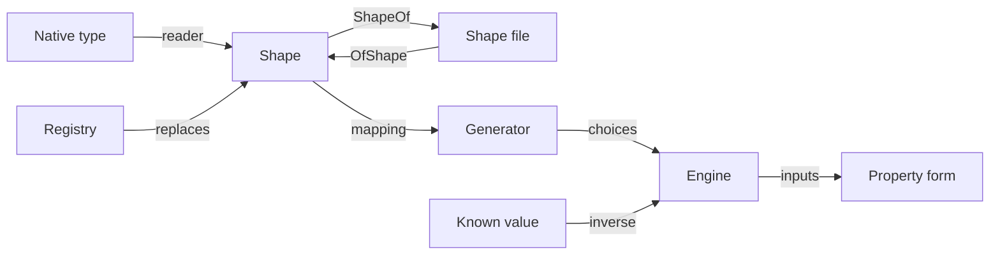

# RFC-0011: Property forms and inputs derived from types

## Summary

Of the 57 assertions, 38 get a property form in the `prop` package under
the same name. The form takes a function where the assertion takes the
value it examines. The engine of RFC-0010 calls that function with
inputs that it generates from the function's parameter type, and runs
the assertion on each result. A relation's form generates the inputs
that the relation takes:

```go
prop.Equal(t, fastSort, referenceSort, "fastSort agrees with the reference")
prop.NoError(t, roundTrip, "every order survives encoding and decoding")
prop.RoundTrip(t, codec.Encode, codec.Decode, "Decode undoes Encode")
prop.Commutative(t, Counter.Merge, "Merge ignores the order of its operands")
```

The definition fixes the generator of a type. Each language reads its
types into shapes, and the definition maps every shape to one generator
of the engine. Two types with the same shape produce the same values
from the same seed in every language, and the corpus checks that. The
shapes cover scalars, collections, records and variants, dates, times,
durations and time zones, decimals, UUIDs and IP addresses. A shape is
data, so one language can write a type's shape to a file and another can
generate from the file. TypeScript, whose types are erased, derives its
inputs that way.

Every shape's generator also runs backwards, from a value to the choices
that produce it. A known input, from a bug report or from production,
runs as an example and shrinks like a generated one.

## Motivation

### A caller already knows the assertions

A caller of the property engine learns a second vocabulary: a run, a
case, draws and generators. A caller of this standard already knows the
assertions. The most common properties are those assertions stated for
every input instead of one:

| Property | For one input | As a property form |
|---|---|---|
| Two implementations agree | `assert.Equal(t, fast(x), ref(x), msg)` | `prop.Equal(t, fast, ref, msg)` |
| Decoding undoes encoding | `assert.RoundTrip(t, encode, decode, x, msg)` | `prop.RoundTrip(t, encode, decode, msg)` |
| A function never fails on valid input | `assert.NoError(t, f(x), msg)` | `prop.NoError(t, f, msg)` |
| A function never panics | `assert.NotPanics(t, func() { f(x) }, msg)` | `prop.NotPanics(t, f, msg)` |
| A result is within bounds | `assert.InRange(t, f(x), lo, hi, msg)` | `prop.InRange(t, f, lo, hi, msg)` |
| An invariant | `assert.True(t, ok(x), msg)` | `prop.True(t, ok, msg)` |

A study of how developers at one company use property-based testing
interviewed 31 of them in 30 interviews. Differential properties, which
compare an implementation with a reference, were the most common: 17 of
the 30 interviews described them. Round-trip properties followed at 11,
and properties that only provoke a crash or an uncaught exception at 7.
The three are `prop.Equal`, `prop.RoundTrip` and `prop.NotPanics`.

### Writing a generator is the cost

In the same study, 19 of the 30 interviews described generators written
by hand and 19 described generators derived from types. Participants
called writing generators tedious in 6 interviews and high-effort in 7.
The authors record as an observation that developers see writing
generators as a distraction and prefer derived generators.

A property form with a derived input needs no generator at all. A caller
writes one only when the type admits values that the domain does not,
and then only for that type.

### Deriving from types exists, and means something different everywhere

Hypothesis's `from_type`, proptest's derived `Arbitrary`, Kotest's
`checkAll` with only type parameters and rapid's `Make` each turn a type
into a generator. Each does it by its own rules: which integer range a
field gets, whether a float field produces NaN, how deep a recursive type
goes, and in which order fields are generated. The spread is widest for
dates:

| Library | What it generates for a date or an instant |
|---|---|
| Hypothesis 6.168.3 | Years 1 to 9999, shrinking towards 2000-01-01, with values near daylight-saving transitions on purpose |
| Kotest 6.2.5 | `localDate` from 1970 to 2030 |
| fast-check 4.10.2 | ±8.64 × 10¹⁵ ms around the epoch, including `Invalid Date` unless `noInvalidDate` is set |
| proptest 1.11.0 | `SystemTime` within ±2³¹ seconds of the epoch, and `Instant::now()`, which does not shrink |
| rapid 1.3.0 | `Make` skips unexported fields and has no case for `time.Time`, so it produces the zero time |

A derived generator then produces different values in each language for
the same declared type. The engine fixes how every other input is
generated, and deriving by each language's rules would reopen the gap at
the most convenient entry point.

The assertion set excluded anything that reads a language's type
system, because such an assertion cannot be implemented six times. This
proposal keeps that exclusion where it matters and moves it: reading a
type is per language, and what a type means as a domain is not.

## Detailed design

### Components

| Component | Responsibility | Tier |
|---|---|---|
| Type reader | Reads a native type, with its constraints, into a shape | Per language, within the reading rules |
| Shape mapping | Maps each shape to generators of the engine | Fixed |
| Inverse | Computes the choices that decode to a given value, for every generator and for `filter` | Fixed |
| Registry | Replaces the shape or the generator of a type | Named |
| Shape files | Writes a type's shape as JSON, and generates from a file | Fixed format |
| Property forms | Run an assertion over generated inputs, as `prop-for-all` runs a body | Fixed |
| Zone data | The zone list, and every offset change of its zones | Fixed data |



### Shapes

A shape is a language-neutral description of a type's values. Each
language reads its own types into shapes. The definition maps each shape
to generators of the property engine, and that mapping is fixed.

The structural shapes:

| Shape | Parameters | Generator |
|---|---|---|
| `bool` | | `boolean`, with p = 1/2 |
| `int` | `width` of 8, 16, 32, 64 or 128, and `signed` | `integer` over the width's whole range. Width 128 is two `integer` choices in one span: the high 64 bits, signed when the shape is, then the low 64 bits, unsigned |
| `float` | `width` of 32 or 64 | `float` over the finite values of the width |
| `char` | | `string` with `min_size` and `max_size` 1, over the default alphabet |
| `string` | | `string` over the default alphabet |
| `bytes` | | `bytes` |
| `list` | `of` | `list` of `of` |
| `fixed-list` | `of`, `size` | `list` of `of`, with `min_size` and `max_size` both `size` |
| `set` | `of` | `list` of `of`, with `unique` |
| `map` | `key`, `of` | `dict` from `key` to `of` |
| `optional` | `of` | `optional` of `of` |
| `record` | ordered `fields`, each a name and a shape | Each field in order, as one span |
| `enum` | ordered `variants`, each a name and an optional payload shape | `one-of` over the variants, then the payload |
| `literal` | ordered `values` | `sampled-from` over the values |
| `ref` | `name` of a definition | The shape that the definition names |

The domain shapes:

| Shape | Parameters | Generator, and the value it decodes to |
|---|---|---|
| `uuid` | | `bytes` with `min_size` and `max_size` 16: the UUID's bytes in order |
| `ip-address` | `version` of 4 or 6 | `bytes` of 4 or 16: the address in network order. Without `version`, an `enum` of `v4` and `v6` |
| `decimal` | `scale` | `integer` over the signed 64-bit range: the unscaled value, divided by 10 to the power of `scale` |
| `instant` | `unit` of `s`, `ms`, `us` or `ns` | Two `integer` choices in one span: the seconds since 1970-01-01T00:00:00Z, then the units within the second. At a unit of `s`, the seconds alone |
| `date` | | `integer`: the days since 1970-01-01 |
| `time-of-day` | `unit` | `integer` from 0 to the last unit before midnight: the units since midnight |
| `local-date-time` | `unit` | A `record` of a `date` and a `time-of-day`, without a zone |
| `duration` | `unit` | `integer`: a signed number of units |
| `offset` | | `integer` from −64,800 to 64,800: the seconds east of UTC |
| `zone` | | `sampled-from` the zone list, UTC first |
| `zoned-date-time` | `unit` | A `record` of an `instant` and a `zone`, generated near the zone's offset changes |
| `wall-time` | `unit` | A `record` of a `local-date-time` and a `zone`, generated near the zone's offset changes |

The rule that makes the guarantee: **two types with the same shape,
meaning the same fields in the same order with the same constraints and
units, produce the same values from the same seed in every language.**

#### Defaults

- A float produces no NaN and no infinity unless a constraint admits
  them. NaN is unequal to itself under this standard, so a default that
  produced it would fail every `prop.Equal` over a float field for a
  reason the caller did not ask about.
- An `int` and a `float` range over their width.
- An `instant`, a `date` and a `local-date-time` range from
  0001-01-01T00:00:00Z to 9999-12-31T23:59:59.999999999Z, at their unit.
  Every target language's standard type represents that range. Python's
  `datetime` is the narrowest, from year 1 to 9999. JavaScript's `Date`
  covers years −271821 to 275760. Go and Java cover more.
- That range is 3.2 × 10²⁰ nanoseconds, 17 times what one `integer`
  choice can state. RFC-0010 bounds an integer by the signed or the
  unsigned 64-bit range. So an instant is two choices, its seconds and
  the units within the second, as Java's `Instant` and Protocol Buffers'
  `Timestamp` store it. A `local-date-time` is two choices already, its
  date and its time of day.
- A `duration` ranges over ±(2⁶³ − 1) nanoseconds. That is the range of
  Go's `time.Duration`, about 292 years.
- A `decimal` has no default `scale`. No single scale suits most
  domains, so a decimal that states no scale fails to read. The failure
  names the field.
- Each date and time shape takes its origin as its target. An instant
  shrinks to 1970-01-01T00:00:00Z, a date to 1970-01-01, a time of day
  to midnight, a duration to zero, and an offset to UTC. Two of the
  engine's four edge cases put every value at a bound, so every run
  tries the first instant of year 1 and the last instant of year 9999.

A unit follows the language's type, as a width does. A Go `time.Time` is
an `instant` at nanoseconds. A Python `datetime` is one at microseconds,
and a JavaScript `Date` one at milliseconds. A Go struct and a Python
dataclass produce the same instants only when their units agree. A
caller porting a test between them states the coarser unit with a
constraint.

#### Time zones

The zone list is part of the definition. Each zone covers a rule that
code which handles time zones gets wrong:

| Zone | What it covers |
|---|---|
| `UTC` | No offset and no change |
| `Europe/Amsterdam` | Northern daylight saving under the European rules |
| `America/New_York` | Northern daylight saving under the United States rules |
| `Australia/Sydney` | Southern daylight saving |
| `Australia/Lord_Howe` | A daylight-saving shift of 30 minutes, between +10:30 and +11:00 |
| `Pacific/Chatham` | Offsets of +12:45 and +13:45 |
| `Asia/Kolkata` | +05:30, unchanged since 1945 |
| `Asia/Kathmandu` | +05:45, since 1986 |
| `America/St_Johns` | −03:30 with daylight saving |
| `Asia/Tehran` | +03:30, with daylight saving until 2022 |
| `America/Sao_Paulo` | Southern daylight saving until 2019 |
| `Pacific/Kiritimati` | +14:00, which skipped 31 December 1994 |
| `Pacific/Apia` | A skipped day, 30 December 2011 |
| `Europe/Dublin` | Daylight saving that tzdata states as negative, in winter |
| `Africa/Casablanca` | An offset lowered by one hour during Ramadan, until 2026 |
| `Antarctica/Troll` | A daylight-saving shift of two hours |

An instant in a zone has one wall time in every language. A wall time in
a zone does not always have one instant: a wall time inside a gap has
none, and one inside a fold has two. Go's `time.Date` documents that, for
such a wall time, it returns a time correct in one of the two zones
involved and does not guarantee which. So a `zoned-date-time` is an
instant and a zone, and its value is the same in every language. A
`wall-time` is a wall time and a zone that the code under test resolves,
which is what a test of gap and fold handling checks. No native type
reads as a `wall-time`, so a caller names it in a shape file and
generates from that file with `OfShape`.

The definition contains every offset change of the listed zones from
1900 to 2100, 2,588 instants computed from tzdata 2026e. A stored
case decodes an index into that table, so the table changes only with a
major version of the definition. A tzdata release alone does not change
it. An offset change that a later release adds is generated as any other
instant is. A `boolean` with p = 1/4 decides whether a value comes from
the table:

- A `zoned-date-time` from the table takes one of its zone's offset
  changes, through `sampled-from`, and then an `integer` from −1 to 1
  units. Its instant is one unit before, at or after the change.
- A `wall-time` from the table takes one of its zone's offset changes,
  an `integer` from −1 to 1 units, and a `boolean` that picks the offset
  before or after the change. Its wall time is the change's instant in
  that offset, moved by the integer. This produces the wall times that a
  gap skips and that a fold repeats.
- Every other value takes its instant or its wall time from the whole
  range.

Hypothesis generates values near offset changes on purpose for the same
reason, and Kotest includes zone transitions in its date edge cases.

A measurement chose the odds of 1 in 4 over 0, 1 in 8, 1 in 2 and 3 in 4.
The executable reference ran seven seeded bugs, each on 2,000 seeds of
100 cases with shrinking off. Five of the bugs fail only near an offset
change: a wall time in a gap, a wall time in a fold, an off-by-one at the
instant of a change, an offset computed once per UTC day, and a wall time
in a gap of Lord Howe's 30-minute shift. One fails on a fractional
offset. One fails only on an instant in the years 3000 to 3099, which
only the whole range produces. Each cell is the share of runs that found
the bug:

| Odds | Gap | Fold | Off-by-one | Offset per day | Lord Howe gap | Fractional offset | Years 3000 to 3099 |
|---|---|---|---|---|---|---|---|
| 0 | 0.1% | 0% | 0% | 0.1% | 0% | 100% | 12.5% |
| 1 in 8 | 94.0% | 91.5% | 100% | 100% | 17.6% | 100% | 10.7% |
| 1 in 4 | 99.7% | 99.6% | 100% | 100% | 31.4% | 100% | 9.3% |
| 1 in 2 | 100% | 100% | 100% | 100% | 52.6% | 100% | 6.6% |
| 3 in 4 | 100% | 100% | 100% | 100% | 68.2% | 100% | 3.5% |

1 in 4 is the lowest of these odds at which the gap and the fold are
found in more than 99% of runs. 1 in 2 finds the Lord Howe gap more
often, and finds the bug of the whole range about half as often as no
bias does.

A platform whose time-zone data is of another release, or lacks a listed
zone, can resolve the same instant to another wall time. The generated
value does not change, and the platform's overlay declares the
difference.

#### Recursion

A shape file states named definitions beside its root shape, as JSON
Schema states `$defs` beside a schema, and a `ref` names one of them. A
type that refers to itself, directly or through other types, reads as a
definition and a `ref` to it. A reference back must pass through an
`optional`, a `list`, a `set`, a `map`, or an `enum` with a variant that
does not refer back. A shape without such an exit has no finite value,
and reading it fails.

A value of a recursive shape has a budget of 100 nodes, counted in the
order the nodes are generated, as the `recursive` generator of RFC-0010
bounds a value by 100 leaves. Once a value has used its budget, every
`optional` that refers back is absent, and every `list`, `set` and `map`
that refers back takes no further element. Every `enum` that refers back
takes its first variant that does not. A tree type then terminates
without a caller stating a bound. A depth cut would not bound the size. A node with a
list of children, at the default average of 5, grows fivefold per level,
to about 780 nodes at depth 4.

### Constraints

A constraint narrows a shape's generator:

| Constraint | Applies to | Effect |
|---|---|---|
| `min`, `max` | `int`, `float`, `decimal`, `instant`, `date`, `time-of-day`, `local-date-time`, `duration`, `offset` | Bounds the value |
| `min_size`, `max_size` | `string`, `bytes`, `list`, `set`, `map` | Bounds the size |
| `pattern` | `string` | Generates with `string-matching` |
| `alphabet` | `string`, `char` | Replaces the default alphabet |
| `allow_nan`, `allow_infinity` | `float` | Admits NaN or the infinities |
| `unit` | `instant`, `time-of-day`, `local-date-time`, `duration`, `zoned-date-time`, `wall-time` | Sets the resolution |
| `scale` | `decimal` | Sets the number of digits after the point |
| `version` | `ip-address` | Admits one version |

An exclusive bound becomes the inclusive bound one step inside it. A step
is one for an integer, one unscaled unit for a decimal, one unit for a
date or a time, and the adjacent value of its width for a float.

A `min` or a `max` on an `instant` or a `local-date-time` bounds its
first choice, the seconds or the date, by the bound's seconds or date.
The second choice ranges over the whole second or the whole day. Where
the first choice equals a bound's seconds or date, the second choice
stops at that bound instead.

Each language states constraints in the metadata that its types already
have:

| Language | Where a caller states constraints | Example |
|---|---|---|
| Go | A `prop` struct tag | ``Qty int `prop:"min=1,max=99"` `` |
| Python | `typing.Annotated` with annotated-types, and the markers of `prop` for what annotated-types does not state | `Annotated[int, Ge(1), Le(99)]` |
| Rust | Attributes of the derive | `#[prop(min = 1, max = 99)] qty: u32` |
| Java, Kotlin | Jakarta Bean Validation, and the annotations of `prop` for what Bean Validation does not state | `@Min(1) @Max(99) int qty` |
| TypeScript | The shape file | `{"shape": "int", "width": 32, "signed": true, "min": 1, "max": 99}` |

Each language maps its own vocabulary onto the constraint table exactly:

- Bean Validation's `@Min`, `@Max`, `@DecimalMin`, `@DecimalMax`,
  `@Positive`, `@PositiveOrZero`, `@Negative` and `@NegativeOrZero`
  become bounds. `@Size` becomes sizes, `@Pattern` a pattern, and
  `@Digits` a decimal's scale and bounds. `@NotNull` changes nothing,
  because a field that is not optional is never absent.
- annotated-types' `Gt`, `Ge`, `Lt`, `Le` and `Interval` become bounds,
  and `MinLen`, `MaxLen` and `Len` become sizes. `Timezone` decides what a
  `datetime` reads as: `Timezone(None)` a `local-date-time`,
  `Timezone(timezone.utc)` an `instant`, and `Timezone(...)` a
  `zoned-date-time`. A `datetime` without `Timezone` fails the read,
  because Python's type does not state whether its values have a zone.

A constraint that the table does not map, such as `@Email`, `@Past` or
an annotated-types `Predicate`, fails the read. The failure names the
field and the constraint. The engine never turns a constraint into a
filter. Hypothesis applies annotated-types constraints as filters, and a
filter that rejects most values ends a run as `rejected`, whose record
states counts and no field.

### Reading a type into a shape

Each language reads its types its own way. The mapping from a native
type to a shape is in the naming table, so the gate checks it. It is the
only part of derivation that a language decides.

| Language | Reads types through | Reads | Does not read |
|---|---|---|---|
| Go | `reflect`, from a type parameter | `bool`, the sized integers, `float32`, `float64`, `string`, `[]byte` and `[N]byte` as `bytes`, slices, arrays, maps, `map[T]struct{}` as a `set`, structs, pointers as `optional`, `time.Time` as an `instant` at nanoseconds, `time.Duration`, `*time.Location` as a `zone`, `uuid.UUID`, `netip.Addr`, `*big.Int` as a 128-bit `int`, `*big.Rat` as a `decimal` | Interfaces without `RegisterVariants`, channels, functions. Unexported fields keep their zero value. A `rune` reads as an `int32` unless its tag states `char` |
| Python | `typing.get_type_hints` | `bool`, `int` as a signed 64-bit `int` unless constrained, `float`, `str`, `bytes`, `list`, `tuple` as a `record`, `set`, `frozenset`, `dict`, `Optional`, a union as an `enum` of its members, `Literal`, `Enum`, dataclasses, `TypedDict`, `NamedTuple`, `date`, `time`, `datetime` by its `Timezone` constraint, `timedelta`, `ZoneInfo`, `UUID`, `IPv4Address`, `IPv6Address`, `Decimal` | `Any`, and protocols without registration |
| Rust | A derive macro, at compile time | The primitives with `i128`, `u128` and `char`, `String`, `Vec`, arrays, tuples as records, `HashMap`, `BTreeMap`, `HashSet`, `BTreeSet`, `Option`, `Box` as its content, structs, enums, `SystemTime`, `Duration` with a minimum of 0, `IpAddr`, and the types of `chrono`, `time`, `jiff`, `uuid` and `rust_decimal` behind features of the derive crate | Trait objects. A type from another crate needs a newtype or a registration |
| Java | Reflection | The primitives and their boxes, `char` within the Basic Multilingual Plane, `String`, `List`, `Set`, `Map`, `Optional`, records, enums, sealed interfaces, `Instant`, `LocalDate`, `LocalTime`, `LocalDateTime`, `Duration`, `ZoneOffset`, `ZoneId`, `ZonedDateTime`, `UUID`, `InetAddress`, `BigInteger` as a 128-bit `int`, `BigDecimal` | A plain class, because reflection does not promise its fields' order |
| Kotlin | Kotlin reflection | Data classes in constructor order, sealed classes, enums, the collections, `Pair` and `Triple` as records, `kotlin.time.Duration`, the kotlinx-datetime types, `Uuid`, and the Java types | Classes other than data classes, and interfaces that are not sealed |
| TypeScript | Shape files only, because types are erased at run time | Every type whose shape file another language or a person wrote. A date or time shape decodes to a `Temporal` value, which Node 26 provides | Every type without a shape file |

Field order is declaration order, and it decides which choices a field
consumes. Java's plain classes are not read for that reason: two JVMs may
return their fields in different orders, and the same seed would then
produce different values. A tuple reads as a record whose fields are
named by position: `0`, `1`, `2`.

Width follows the language's type. A Go `int` is a 64-bit `int` on a
64-bit platform. A Python `int` has no width, so it reads as a signed
64-bit `int`, and a caller who wants another width states it with a
constraint. A Java `int` is 32 bits. A Go struct and a Python dataclass
produce the same values only when their fields agree in width and unit,
and a caller porting a test between them aligns both.

A type whose construction can fail, such as a Java record whose canonical
constructor validates its arguments, is built through that constructor.
A construction that throws fails the case, and the failure is the
constructor's error. The shrinker reduces it to the smallest input that
the constructor refuses. That input shows the caller the constraint that
the shape needs, or that the type needs a registration. Hypothesis's
`builds` lets a constructor's exception fail the test the same way.
Rejecting the case instead would hide a constructor that throws on a
valid input.

### Registering a shape or a generator

```text
Of[T]() -> Generator[T]
    The generator of T: a registered one when it exists, otherwise the
    generator of T's shape.
RegisterValues[T](values...)
    Makes T's shape a literal over the values, in the order given.
RegisterVariants[I](variants...)
    Makes I's shape an enum whose variants are the types of the given
    values, in the order given, each named by its type and with its
    type's shape as its payload.
Register[T](generator)
    Makes generator the one that Of[T] returns.
Using[T](generator) -> Option
    Makes generator the one that a single property uses for T, at every
    occurrence of T in its inputs.
```

A registration applies to the whole test process. A registration after
the first property has started fails, so a test that runs in parallel
never sees a generator change. Registrations happen before any
property runs, in `init`, `TestMain` or a pytest `conftest.py`. The test
process differs by language: one test binary per package in Go, a pytest
process, and a test file's isolated environment under vitest's default
settings. In Go, a helper package that registers in its own `init`
applies its registrations to every test package that imports it.

Go has no enumerations, so `type Status int` reads as an `int` over its
whole range. Go has no sum types either, so an interface field cannot be
read at all. A Go test package registers both in `init`:

```go
func init() {
	prop.RegisterValues(Pending, Paid, Shipped)
	prop.RegisterVariants[Event](Created{}, Refunded{}, Cancelled{})
}
```

`RegisterValues` and `RegisterVariants` register a shape, so `ShapeOf`
writes it and a reader in another language generates the same values.
`Register` registers a generator that may have no shape, such as one
built with `map` or `filter`. `ShapeOf` of a type that contains such a
type fails and names the field. `Using` is for a property that needs a
narrower domain than the rest. A generator comes from `Using` first, then
from a registration, then from the type's shape.

`Of[T]` is an ordinary generator, so a body that draws explicitly can use
it too:

```go
prop.ForAll(t, "a transfer conserves money", func(c *prop.Case) {
	from := c.Draw(prop.Of[Account](), "from")
	to := c.Draw(prop.Of[Account](), "to")
	amount := c.Draw(prop.Integer[int64](1, 1_000_000), "amount")
	…
})
```

### Shape files

A shape is data, so a language can write the shape of a type out and
another can generate from it:

```text
ShapeOf[T]() -> text
    The shape that this language reads from T, with its definitions, as
    JSON in the format that the corpus states shapes in.
OfShape(text) -> Generator
    The generator of a shape read from JSON.
```

`OfShape` decodes a record to the language's plain map or object with
the record's fields, and a variant to its name and its payload. Every
other shape decodes to the language's type for it. A shape that has no
type in a language decodes to the nearest one: in Go, a `date` and a
`local-date-time` decode to a `time.Time` in UTC, and a `time-of-day` to
a `time.Duration` since midnight.

`ShapeOf` writes an optional `source` field with the language and the
qualified name of the type, such as
`{"language": "go", "type": "example.com/shop.Order"}`. A reader ignores
the field when it compares two shapes, so one type read in two languages
still has one shape. The field tells a reader of a copied file which
type to check it against.

A shape file is a golden file. A Go test compares the type's shape with
the file through the golden-file assertion. A change to the type then
fails the test until the file is updated:

```go
func TestOrderShape(t *testing.T) {
	shape, err := prop.ShapeOf[Order]()
	assert.NoError(t, err, "Order reads into a shape")
	golden.Match(t, "order.shape.json", shape, golden.ShouldUpdate())
}
```

A TypeScript property reads the same file. From the same seed, it
generates the same orders as a Go property over `Order`:

```typescript
const orderShape = readFileSync("testdata/golden/order.shape.json", "utf8");

test("a total is never negative", ({ seat }) => {
  prop.inRange(seat, (o: Order) => total(o), 0, Number.MAX_SAFE_INTEGER,
    "a total is never negative", prop.using(prop.ofShape<Order>(orderShape)));
});
```

Shape files have these uses:

- TypeScript derives inputs for a type from a shape file that another
  language or a person wrote. A TypeScript property form takes its
  input's generator through `using`, because TypeScript has no type to
  key a generator by.
- Services that exchange a message type test their encoders with the
  same inputs when they read one shape file.
- The corpus checks each language's reader against fixture types, as the
  corpus section describes.

### From a value back to choices

Every shape's generator runs backwards. Given a value of the type, the
engine computes the choices that decode to it.

- Every generator of RFC-0010 runs backwards.
- Of its four combinators, `filter` runs backwards through its source
  generator, and fails for a value that its predicate rejects. `map`,
  `bind` and `composite` apply a function that the engine cannot invert.
  A registered generator built with one of them does not run backwards.
- Where more than one sequence of choices decodes to a value, the engine
  takes the first in a fixed order. A `one-of` takes its first
  alternative whose inverse succeeds, and a `sampled-from` the first
  index of an equal value. A `permutation` takes the smallest index at
  each swap. A `string-matching` pattern takes the match that a
  backtracking engine finds first, which tries alternatives in order and
  repeats each quantifier as often as the rest of the pattern allows.
- A set's elements and a map's entries are encoded in the shortlex order
  of their own choices. A Go map, whose iteration order varies between
  runs, then gives one sequence of choices.
- A `zoned-date-time` and a `wall-time` run backwards through the branch
  that takes the whole range. A value at an offset change then has the
  same one sequence of choices as any other value.

Hypothesis 6.168.3 inverts its strategies the same way internally. Its
`one_of` tries its alternatives in order, and its filter inverts through
its source. A strategy that it cannot invert raises `CannotInvert`.

```text
Example[T](values...T) -> Option
    Runs a property form first on a case whose generated arguments
    decode to values, one value per generated argument in the argument
    order: one for a form over a function, two for commutative and three
    for associative. A failing example shrinks like any other case.
Draws(json) -> Option
    Runs a prop-for-all body first on a case whose draws decode to the
    entries in json: a label and a typed literal per draw, in request
    order, in the format a store entry records its counterexample in.
```

`Example` with the wrong number of values fails when the property is
built. Each draw of a `Draws` case computes its choices from the entry
with its label. A draw whose label differs from the next entry, or whose
generator cannot run backwards, fails the test before any other case
runs, and the failure names the label. When the entries run out, every
further draw takes its target, as a replay that runs out of choices
does.

Examples have these uses:

- An input that a caller already knows matters, such as the one from a
  bug report, runs on every run. When it fails, it shrinks to the part of
  it that matters.
- An input captured from production, such as a message that crashed a
  parser, becomes a test that shrinks, without a person reducing it by
  hand.
- An offset change of a zone that a caller's code depends on, such as a
  change that the zone list does not contain, runs on every run as an
  instant or a wall time.
- A counterexample copied from a failure report or a store entry becomes
  a regression case in the test's source, independent of the store.
- A store entry can be written by hand as values. The engine computes
  its choices the first time it replays the entry.

Decoding the computed choices returns the value, and that rule makes an
example exact. A value that the shape cannot produce, such as a string
longer than its `max_size`, makes `Example` fail when the property is
built, and the failure names the field.

### Property forms

#### The rule

- **A value that an assertion examines becomes a function of the
  input.** The other arguments are values: `prop.InRange` takes a
  function and two bounds.
- **`equal`, `not-equal` and `permutation` take `want` as a function of
  the same input too.** A property's expected value almost always
  depends on the input, through a reference implementation or a formula.
  "A sort returns a permutation of its input" needs `want` to be the
  input. A constant `want` is a `prop.True` with a comparison in it.
- **A callable that an assertion takes gains the generated input as a
  parameter, after its handle.** This applies to `throws`, `not-throws`,
  `pure`, `not-pure`, `nil-context-safe`, `honours-cancellation`,
  `honours-deadline` and `max-allocs`.
- **A relation generates the inputs that it takes.** `idempotent`,
  `accumulates`, `deterministic` and `round-trip` generate `input`,
  `commutative` generates `a` and `b`, and `associative` generates `a`,
  `b` and `c`. `not-pure` follows the rule for callables, as `pure` does.

A function of more than one input is a function of one record. A Go
caller writes a struct. A language that can take a function of more than
one parameter, such as Python or Kotlin, may accept one, and generates its
parameters in order as the fields of a record. The two produce the same
choices, so the choice is a spelling and not a meaning.

#### In Go

```go
func Equal[T, U any](tb assert.TB, got, want func(T) U, msg string, opts ...Option)
func IsPermutation[T, E any](tb assert.TB, got, want func(T) []E, msg string, opts ...Option)
func True[T any](tb assert.TB, cond func(T) bool, msg string, opts ...Option)
func NoError[T any](tb assert.TB, fn func(T) error, msg string, opts ...Option)
func InRange[T, N any](tb assert.TB, got func(T) N, low, high float64, msg string, opts ...Option)
func NotPanics[T any](tb assert.TB, fn func(T), msg string, opts ...Option)
func Pure[T, S any](tb assert.TB, observe func() S, fn func(T), msg string, opts ...Option)
func HonoursCancellation[T any](tb assert.TB, fn func(ctx context.Context, in T) error, msg string, opts ...Option)
func MaxAllocs[T any](tb assert.TB, fn func(T), ceiling uint64, msg string, opts ...Option)
func Idempotent[I, S any](tb assert.TB, call func(I) error, observe func() S, msg string, opts ...Option)
func RoundTrip[I, E any](tb assert.TB, forward func(I) (E, error), inverse func(E) (I, error), msg string,
	opts ...Option)
func Commutative[T, R any](tb assert.TB, combine func(a, b T) R, msg string, opts ...Option)
func Associative[T any](tb assert.TB, combine func(a, b T) T, msg string, opts ...Option)
```

Go infers every type parameter from the arguments, except the error
type of `prop.ErrorAs`, which a caller states as for `assert.ErrorAs`.

#### Inputs, labels and the record

A property form is a `prop-for-all` whose body draws the generated
arguments and calls the root assertion on them. It draws each generated
argument once, labelled with the argument's name in the definition:
`input` for a form over a function, and `a`, `b` and `c` for
`commutative` and `associative`.

A form reports a record of its own id, such as `prop-equal`, with the
detail fields of `prop-for-all`. Its `failure` is the root assertion's
record of the minimal case, and its `counterexample` lists the generated
arguments. A form aborts only, as `prop-for-all` does.

A shape that maps to one `integer`, such as an `int`, a `date` or an
`offset`, is a draw from `integer`. The counterexample then states the
nearest value that passes for such an argument, as RFC-0010 states for a
draw from `integer`.

#### Relaxations and options

A form takes, after its message, the engine's options and the
relaxations that its assertion accepts. A relaxation applies to the
assertion's comparison in every case of the run:
`prop.Equal(t, decode, reference, msg, prop.Cases(500), assert.EquateNaNs())`
compares each pair of results with NaNs equal. Each language states how
one variadic list accepts both kinds of option.

#### `prop.MaxAllocs`

`prop.MaxAllocs` checks an allocation ceiling for every generated input,
and shrinks to the smallest input that allocates more. It finds what a
check of one input misses: a codec, for example, that allocates only
when a field outgrows a buffer. The engine draws the input before it
counts, so its own allocations are not counted. The count covers the
whole process, so the form runs one case at a time whatever `workers` is
set to, and in Go the test that calls it does not run in parallel, as
for `assert.MaxAllocs`. Go's `max-allocs` calls the function 101 times,
which is 10,100 calls for a run of 100 cases before any shrinking. Where
`max-allocs` is absent or not checked, its property form is too: in Java,
Kotlin, Python and TypeScript, partly in Rust, and in Go builds with the
race detector, msan or asan, or with optimisation or inlining turned
off.

#### The forms

| Group | Assertions with a property form |
|---|---|
| Values | `equal`, `not-equal`, `true`, `false`, `nil`, `not-nil`, `length`, `empty`, `not-empty`, `contains`, `not-contains`, `contains-in-order`, `permutation`, `has-prefix`, `has-suffix`, `matches`, `close-to`, `in-range`, `pairwise` |
| Errors | `err-absent`, `err-present`, `err-is`, `err-is-not`, `err-as` |
| Raising | `throws`, `not-throws` |
| Behaviour | `pure`, `not-pure`, `nil-context-safe`, `honours-cancellation`, `honours-deadline`, `max-allocs` |
| Relations | `idempotent`, `accumulates`, `deterministic`, `commutative`, `associative`, `round-trip` |

That is 38 forms. The other 19 assertions have none, each for a stated
reason:

| Assertion | Why it has no property form |
|---|---|
| `eventually`, `eventually-true` | They retry one body over time, and a property already runs a body many times |
| `completes-within` | A duration measured once per generated input is noise, not a property |
| `no-task-leaks` | It scopes a block, not an input |
| The golden-file and benchmark assertions | Their argument is a file or a measurement, not a value |
| `rejects` | It drives a check, not a subject |
| `prop-for-all` | It is the property that every form runs |
| `total` | Generating its domain gives a call that succeeds for every generated input, which is the form of `err-absent`. RFC-0010 fails a case whose body raises, so the two coincide, and `total`'s `index` means nothing for a generated input |
| `stable-order`, `no-duplicates`, `monotonic`, `after-close`, `poisoned` | Their callables read a subject's state and take no input, as RFC-0002 states |

### Names and the definition

The assertion table gains one entry for each form, rendered from one
rule:

- The id is `prop-` and the assertion's id, such as `prop-equal`.
- The package is `prop`, and the detail fields are those of
  `prop-for-all`.
- The arity is the assertion's arity less the arguments that the form
  generates. A form over a function keeps its assertion's arity, because
  the function takes the place of the value. `prop-idempotent` and
  `prop-round-trip` have an arity of 3, and `prop-deterministic`,
  `prop-commutative` and `prop-associative` an arity of 2.

The property form of an assertion takes the assertion's name in the
`prop` package: `prop.Equal` in Go, `prop.equal` in Python,
`prop::equal` in Rust, `prop.equal` in TypeScript and `Prop.equal` in
Java and Kotlin. The naming table states this as one rule, and rendering
expands it into a row per form, so the gate checks every one.

The rule has one exception. Go's `prop` package already declares
`prop.Permutation`, the generator of permutations, and a Go package
cannot declare one name twice. Go names the form of `permutation`
`prop.IsPermutation`, and the naming table states the exception with its
reason. In every other language the assertion's name differs from the
generator's: `prop.is_permutation` beside `prop.permutation` in Python,
for example.

Beside the forms, the naming table gains nine rows: `of`, `register`,
`register-values`, `register-variants`, `using`, `example`, `draws`,
`shape-of` and `of-shape`.

| Tier | What it covers here |
|---|---|
| Fixed | The shapes and their generators, their parameters, constraints, defaults and units. The inverse of every generator, and the order that picks one sequence of choices. The recursion budget and its exits. The zone list, the offset-change table and its odds. The format of a shape file. The rule that turns an assertion into its form, the labels, the record and the arity |
| Named | Every form, through the rule. The nine helpers |
| Declared | A shape that a language has no type for. A JVM `char` limited to the Basic Multilingual Plane. A Go `int` of 32 bits on a 32-bit platform. Time-zone data of another release. `max-allocs` where the language counts no allocations |
| Free | How a language attaches constraints to a type: tags, annotations, attributes or a shape file. Which native type a shape decodes to where the language has several. How one option list accepts both the engine's options and the relaxations |

RFC-0010 lists generators derived from types as free. This proposal
makes the derivation fixed, and leaves only the reading of a type to each
language, within the reading table.

### The corpus

A shape is data, so the corpus states shapes and the values that a seed
must produce from them:

```json
{ "id": "record/seed-42-first-three",
  "shape": { "shape": "record", "fields": [
      ["id", { "shape": "int", "width": 32, "signed": false }],
      ["name", { "shape": "string", "max_size": 8 }] ] },
  "seed": "42",
  "values": [ { "type": "record", "fields": [ ["id", {"type": "int", "value": 0}],
                                              ["name", {"type": "string", "value": ""}] ] } ] }
```

The values above are placeholders. Real vectors come from the executable
reference of the engine, and an implementation confirms them.

The typed-literal encoding gains two types: `record`, an ordered list of
named values, and `variant`, a name and an optional payload. A `map`
literal compares its entries in any order. A record's field order is
part of its shape. No existing type states a variant.

A value of a domain shape is stated in the form that its generator
decodes, and the vector's shape gives the value its meaning:

- An `int` for a date, a time of day, a duration and an offset, in
  days, units or seconds.
- A `record` of its seconds and its units for an instant.
- `bytes` for a UUID and an IP address.
- An `int` of the unscaled value for a decimal.
- A `string` for a zone.
- A `record` of its parts for a `local-date-time`, a `zoned-date-time`
  and a `wall-time`.

The corpus checks each language's reader through fixture types, such as
`order` with an id, a list of lines and an optional note. For each, it
states the shape that the type must read to. Each implementation
declares the fixture types natively, as it builds named subjects, and
its reader must produce the stated shape. A language that has no type
for a shape declares a skip for that fixture.

The corpus tests a property form through named subjects: a function kind
from a small vocabulary, such as `identity`, `sorts`, `returns-null` and
`raises-on-negative`, over a shape. The forms of the relations reuse the
subject kinds of the relation family, whose callables take any input of
their type. Each form has a passing and a failing case. A failing case
states the root assertion's record with the detail fields that a typed
literal can state and that no earlier case decides. It leaves out a
failure, a raised value and an observation of a subject's state.

| Case kind | Count |
|---|---|
| Shape to values | 2 per shape, 54 |
| Value to choices, per shape | 1 per shape, 27 |
| Value to choices, per generator: the order that picks one sequence | 1 per generator of RFC-0010 and 1 for `filter`, 16 |
| Fixture type to shape | 1 per shape except `wall-time`, which no type reads as, 26 |
| Constraint to shape | 1 per constraint, 8 |
| Draws to choices: a match, a label that differs, a value out of bounds, entries that run out | 4 |
| Property forms | 1 passing and 1 failing per form except `max-allocs`, which no corpus case can state, 74 |

### Versioning

| Change | Version | Why |
|---|---|---|
| A new shape, constraint, registration, helper or form | Minor | Nothing that exists changes |
| A change to the odds of an offset change | Minor | A seed reproduces only within one version, as for the engine's draws |
| A change to the order that picks one sequence of choices | Minor | An example decodes to the same value, and only its shrinking can differ |
| A change to how a shape maps to generators, to a default or to the recursion budget | Major | Stored cases and examples decode to different values |
| A change to the zone list or to the offset-change table | Major | Stored cases decode to other zones and instants |

## Alternatives considered

### A. Explicit generators only

Leave derivation out, as the property engine alone does. Every caller
then builds generators by hand.

**Why not:** without derivation, each call of a property form takes its
input's generator explicitly. A property form is then no shorter than a
`prop-for-all` with a draw, and loses the reason it exists.

### B. Let each language derive by its own rules

Each implementation reads types its own way and builds whatever
generator suits its ecosystem, as the established libraries do.

**Why not:** the same declared type would produce different values in
each language. Most callers would use a derived input, so the engine's
fixed generation would apply only to the callers who avoid the
convenient path. The table of dates in the motivation shows the result.

### C. Explicit shapes everywhere

Drop type reading, and let callers state shapes as data in every
language, as TypeScript has to.

**Why not:** it is uniform and it loses the convenience this proposal
exists for. A Go caller would restate a struct's fields as a shape next
to the struct, and the two would drift.

This is what TypeScript does under this proposal, because its types are
not there to read. A shape file that another language writes from a type
spares a TypeScript caller the hand-written shape.

### D. Generate the shapes from a schema

Describe the types once, in a schema language, and generate both the
types and their generators in every language.

**Why not:** it needs a schema language and a generator for each
language, which the assertion set rejected for its own API. It also
helps only callers whose types already come from a schema.

### E. A quantified chain on the existing surfaces

`assert.ForAll[T](t).Equal(got, want, msg)`, reusing the chain that the
assertion set already has. Go 1.27's generic methods let `Equal` on the
chain infer the type of `got`'s result.

**Why not:** the chain adds nothing that a package function lacks.
`ForAll[T]` makes the caller state `T`, and `prop.Equal` infers it from
`got`. A `ForAll(t)` whose methods infer both types passes only the seat.
A chain on both `assert` and `expect` would also imply a recording form.
Alternative F rejects that form.

### F. Property forms on both surfaces

A recording `prop` beside the aborting one, as `expect` exists beside
`assert`.

**Why not:** a failed property has already run its body many times and
shrunk the result. A test that continues past it learns nothing more from
the same subject. The golden-file and benchmark assertions abort only for
the same reason.

### G. Let the generator resolve a wall time

Generate a wall time and a zone, and resolve them to an instant for the
caller.

**Why not:** the resolution of a wall time in a gap or a fold differs by
language. Go's `time.Date` does not guarantee which of two instants it
returns. The value would then differ by language. Under this proposal a
`zoned-date-time` is an instant and a zone. A `wall-time` leaves the
resolution to the code under test.

### H. Turn every constraint into a filter

Accept any constraint that a language can state. Apply the ones without
a generator parameter as filters, as Hypothesis does for annotated-types.

**Why not:** a filter that rejects most values ends the run as
`rejected`, and that record names no field. Under this proposal, a
constraint that the table cannot state fails the read and names the
field. The caller then registers a generator for the type.

### I. Named string domains

Shapes for an email address, a URL and a hostname, as Hypothesis's
`emails`, fast-check's `emailAddress` and jqwik's web module provide.

**Why not:** each needs a grammar that the portable pattern subset cannot
state exactly. Each library approximates that grammar differently, so
the same name would mean different domains. A caller states the
`pattern` of the subset that their code accepts. A grammar generator in
the engine, which RFC-0010 lists as future work, would change this
answer.

### J. Rename the generator `prop.Permutation` in Go

Free the name for the form of `permutation`.

**Why not:** the generator's name is in the `surface` section of the
naming table, so a rename is a major version. One exception in the
naming table costs less.

### K. Calendar types of one language

Shapes for Java's `Period`, `Year`, `YearMonth` and `MonthDay`.

**Why not:** Go, Python and Rust have no counterpart in their standard
libraries, so the shapes would have one reader. A Java enum such as
`DayOfWeek` already reads as an `enum`.

## Drawbacks

- **The assertion table grows by 38 entries and the naming table by 47
  rows**: 38 forms through one rule, and nine helpers. That is 282 names
  across six languages.
- **The inverses add 28 functions to each implementation.** Each of the
  15 generators, `filter` and the 12 domain shapes gets a function beside
  its decoder, and each pair has to agree exactly.
- **The definition gains time-zone data.** The table of 2,588 offset
  changes is generated from one tzdata release, and the validator checks
  that each zone's changes are ordered and connect. An offset change that a later release adds gets
  no bias until a major version of the definition takes that release.
- **Rust needs a procedural macro**, and with it a second crate to
  publish and version alongside the library, with features for the date,
  UUID and decimal crates it reads.
- **TypeScript derives only from shape files, and decodes dates through
  `Temporal`.** A TypeScript suite keeps a shape file per type, and a
  runtime without `Temporal` declares the date and time shapes absent.
- **A shape file is a second copy of a type.** In the language that
  writes it, the golden-file assertion fails a test when the file and the
  type differ. A TypeScript suite that reads a copy from another
  repository has nothing that tells it the copy is stale.
- **A unit or a width that differs between two ports changes the values
  without a failure.** Only a test that compares the two shape files
  finds it.
- **Java derives records and not plain classes.** A codebase of plain
  classes either annotates their field order or registers generators.
- **Go needs registrations for enumerations and interfaces.** A Go
  struct with a status constant or an interface field derives only after
  `RegisterValues` or `RegisterVariants`.
- **A decimal states its scale.** A `Decimal` or `BigDecimal` field reads
  only with a scale constraint.
- **A constraint outside the table stops derivation.** A record with an
  `@Email` field needs a registration before a derived property over it
  can run.
- **A validating type fails every derived property until it is
  constrained.** A record whose constructor refuses some values needs
  constraints on its shape, or a registration, before a derived property
  over it can pass.
- **A type without a constructor check admits values its domain does
  not.** An email typed as a string gets random text, and a property over
  it can pass on a domain wider than the caller meant.
- **`prop.MaxAllocs` is slow and serial.** It makes 101 calls per case in
  Go, and it runs one case at a time because the allocation count covers
  the whole process.
- **Field order is part of the generated values.** Reordering a struct's
  fields changes what a seed produces and what a stored case decodes to.
  The stored case still replays, as a different input.
- **A Go `int` is 32 bits on a 32-bit platform**, so the same Go test
  produces different values there. The Go overlay declares it.
- **The corpus grows by 209 cases.**

## Unresolved and future work

- Deriving a TypeScript generator from a type at compile time, through a
  transform of the compiler's output, is not proposed here.

## References

| What | Where |
|---|---|
| Goldstein, Cutler, Dickstein, Pierce and Head, "Property-Based Testing in Practice", ICSE 2024 | <https://doi.org/10.1145/3597503.3639581> |
| Hypothesis 6.168.3, `from_type` and its lookup of standard types and annotated-types constraints | <https://github.com/HypothesisWorks/hypothesis/blob/v6.168.3/hypothesis/src/hypothesis/strategies/_internal/types.py> |
| Hypothesis 6.168.3, the date and time strategies | <https://github.com/HypothesisWorks/hypothesis/blob/v6.168.3/hypothesis/src/hypothesis/strategies/_internal/datetime.py> |
| Hypothesis 6.168.3, `_invert` of `one_of`, `sampled_from` and `filter`, and `CannotInvert` | <https://github.com/HypothesisWorks/hypothesis/blob/v6.168.3/hypothesis/src/hypothesis/strategies/_internal/strategies.py> |
| proptest-derive 1.11.0, the derived `Arbitrary` | <https://github.com/proptest-rs/proptest/tree/v1.11.0/proptest-derive> |
| proptest 1.11.0, `Arbitrary` for the standard time types | <https://github.com/proptest-rs/proptest/blob/v1.11.0/proptest/src/arbitrary/_std/time.rs> |
| Kotest 6.2.5, `checkAll` with generators inferred from type parameters | <https://github.com/kotest/kotest/blob/v6.2.5/kotest-property/src/commonMain/kotlin/io/kotest/property/propertyTest1.kt> |
| Kotest 6.2.5, the date and time generators | <https://github.com/kotest/kotest/blob/v6.2.5/kotest-property/src/jvmMain/kotlin/io/kotest/property/arbitrary/dates.kt> |
| fast-check 4.10.2, `date` | <https://github.com/dubzzz/fast-check/blob/v4.10.2/packages/fast-check/src/arbitrary/date.ts> |
| rapid 1.3.0, `Make` | <https://github.com/flyingmutant/rapid/blob/v1.3.0/make.go> |
| jqwik user guide, the time and web modules | <https://jqwik.net/docs/current/user-guide.html> |
| Go 1.27, `time.Date`, `uuid.UUID` and `net/netip.Addr` | <https://pkg.go.dev/time#Date> |
| Java 21, `Class.getDeclaredFields`, which returns fields in no particular order | <https://docs.oracle.com/en/java/javase/21/docs/api/java.base/java/lang/Class.html#getDeclaredFields()> |
| Jakarta Bean Validation 3.0, the built-in constraints | <https://jakarta.ee/specifications/bean-validation/3.0/jakarta-bean-validation-spec-3.0.html#builtinconstraints> |
| annotated-types | <https://github.com/annotated-types/annotated-types> |
| JSON Schema, `$defs` and `$ref` | <https://json-schema.org/understanding-json-schema/structuring> |
| tzdata 2026e, the IANA time zone database | <https://www.iana.org/time-zones> |
