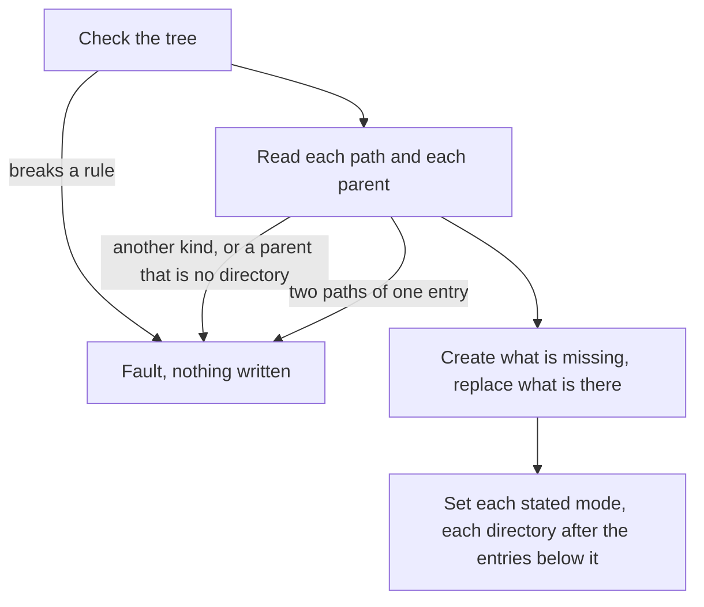

# RFC-0028: Writing a tree into a directory that exists

## Summary

`files.workspace` writes a tree into a directory of the test's own and
writes over no entry. No helper of the definition writes into a directory
that already exists, so a test that edits a file between two calls of the
code under test writes the edit with the language's own file calls. This
adds `files.write`, which writes a tree into a directory that exists. It
creates each entry where nothing is, and replaces the content of a file,
the target of a link and the mode of a stated entry where an entry of the
same kind is. It keeps every entry that the tree does not state, and it
refuses an entry of another kind before it writes anything. Definition
7.1.0 adds it.

## Motivation

### Each suite writes its edits by hand

A test of a tool that keeps state between runs edits a file between two
runs, such as a person's edit of generated output that the second run
reports as drift. In the code bases that we read, one has 23 such edits in
its tests. Two of its packages each declare a helper that creates the
parent directories and writes one file, and four other files each call
`os.WriteFile` once.

Each copy makes the faults that the workspace removed from setup helpers:

- It writes through a link at the path, so an edit can write a file
  outside the test's directory.
- It passes its mode through the umask, so a file gets 0640 under a umask
  of 027 and 0644 under 022.

### Why the definition

The definition states the workspace so that a generator that emits suites
in every target language states a test's files once for all. An edit
between two calls is part of the same test, and a generator has no way to
state it today.

## Detailed design

### The helper

`files.write` takes the seat, a directory that exists, and a tree. It
returns nothing.

- It refuses a tree that breaks a rule of a tree, as the workspace does.
- It reads the entry at each path of the tree, and at each parent of a
  path, before it writes anything. It refuses an entry of another kind
  than the tree states, and a parent that is no directory. A link is
  another kind than a directory, a link to a directory included.
- It refuses a path that the file system maps to an entry that the tree
  states at another path, such as a second name of one file or a path that
  differs only in case on a file system that ignores case.
- Where nothing is at a path, it creates the entry as the workspace
  creates it.
- A file replaces the content of the file at its path, a link replaces the
  target of the link at its path, and a directory keeps its entries.
- It sets the mode of each entry that the tree states: the stated mode,
  and where the tree states none 0644 on a file and 0755 on an executable
  file and on a directory. A parent that the tree implies keeps its mode
  when it exists, and gets 0755 when the helper creates it.
- Every entry that the tree does not state keeps its content and its mode.
- It writes no entry outside the directory, and it never follows a link.
  It replaces a link by removing the link itself.

Each refusal ends the call with a fault before the helper writes anything.
Each error of the file system ends the call with a fault at its path, such
as a file that the helper cannot create in a directory whose mode leaves out
the owner's write bit. A fault stops the test.



### Go

```go
// Write writes tree into dir, a directory that exists. Where nothing is at
// a path of the tree, it creates the entry as Workspace does. A file
// replaces the content of the file at its path, a link replaces the target
// of the link at its path, and a directory keeps its entries. Each entry
// that the tree states gets its stated mode, and where it states none 0644,
// or 0755 for an executable file and a directory. Every other entry of dir
// keeps its content and its mode.
//
// It writes through os.Root and never follows a link.
//
// # Errors
//
// A tree that breaks a rule of a tree, a dir that is no directory, an entry
// of another kind than the tree states, a parent of an entry that is no
// directory, and a path that the file system maps to an entry at another
// path of the tree each end the call with a fault before Write writes
// anything. An error of the file system ends the call with a fault at the
// path of its entry. The fault stops the test.
func Write(tb assert.TB, dir string, tree Tree)
```

`Write` takes an `assert.TB`, because it creates no directory of the
test's own. A test of a generator that reports a person's edit as drift:

```go
dir := files.Workspace(t, files.Tree{"api/store.gen.go": files.Text(generated)})
assert.NoError(t, gen.Run(dir), "the first run writes the file")
files.Write(t, dir, files.Tree{"api/store.gen.go": files.Text(edited)})
assert.ErrorIs(t, gen.Run(dir), gen.ErrDrift, "the second run reports the edit")
```

### Names

| Id | Go | Python | Rust | TypeScript | Java | Kotlin |
|---|---|---|---|---|---|---|
| `files.write` | `files.Write` | `files.write` | `files::write` | `files.write` | `FileTrees.write` | `FileTrees.write` |

### Conformance

A vector pins an assertion's verdict and record, and `files.write` is an
input of a test, as the workspace is. It has no vector. Each language tests
the helper with its own tests, whose tree assertions read back what the
helper wrote.

### Version

Adding a member of the surface table is a minor version change, as adding
an assertion is. Definition 7.1.0 adds `files.write`, and every overlay
extends 7.1.0.

## Alternatives considered

### A. A workspace over a directory that exists

`files.workspace` would take a directory and write over the entries in it.

**Why not:** the workspace writes over no entry, so that it catches a tree
whose two paths the file system maps to one entry. It also creates a
directory of the test's own, which the test removes when it ends. A
directory that a test already has belongs to no single workspace.

### B. A helper that writes one file

`files.write-file` would take a path and a content.

**Why not:** an edit between two runs often touches more than one entry,
and a tree states each entry with its kind and its mode. One helper over a
tree reuses the tree's rules, its literal and its names. A helper over one
file states those rules again for one entry.

### C. A write that makes the directory equal the tree

`files.write` would also remove each entry that the tree does not state,
as an update of a golden tree does.

**Why not:** an edit changes some entries and keeps the rest. A test that
wants a directory equal to a tree writes a new workspace.

### D. Vectors of the helper

A vector would state a workspace, a tree to write, and the tree in the
directory afterwards. Every runner would call the helper and read the tree
back.

**Why not:** the corpus pins the outcome of assertions. A vector of the
helper needs a runner step in six languages and a writer in the reference,
for an input whose rules each language's own tests check through the tree
assertions. A language whose helper differs from this design in a way that
its own tests miss would change this.

## Drawbacks

- Six languages each add a helper that reads the entries before it writes,
  replaces files, link targets and modes, and refuses a mismatch first.
- A refused write leaves the directory as it was only when nothing else
  writes into the directory between the read and the write.
- A write below a directory whose mode leaves out the owner's write bit ends
  with a fault. The workspace avoids that by setting each mode after the
  entries below it, and `files.write` changes no mode of an entry that the
  tree does not state.
- No vector checks the helper.
- The naming table gains one row of six names.
