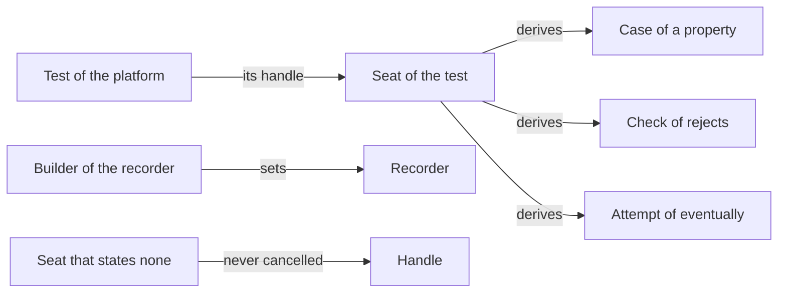

# RFC-0029: The cancellation handle of a seat

## Summary

A helper that takes a seat cannot read the cancellation handle of the test
that runs it. In Go, a helper that takes `assert.TB` passes
`context.Background()` to each call that takes a context, although
`*testing.T`, `*testing.B` and `*prop.Case` each return the test's
context. This adds the seat member `seat.cancellation`, which returns the
handle that `honours-cancellation` hands a subject in the same language:

- A seat that states no handle returns one that is never cancelled.
- The recorder returns the handle that a builder sets.
- The seat that `rejects` hands its check, and the seat that `eventually`
  hands each attempt, return a handle that derives from the handle of the
  assertion's own seat. The assertion cancels it when the body ends.
- A case's handle derives from the handle of the property's seat.
- Go and TypeScript read the handle of any seat through a helper, because
  their seats state the handle through a member that a seat may lack.

Definition 7.2.0 adds the member and the helper.

## Motivation

### A helper has no handle to pass

A helper takes the seat so that a test can pass it the test's own seat, a
case of a property, or a recorder. A test kit has a second reason to take
it: its own tests pass each check to `rejects`, which runs the check on a
seat of its own. In the code bases that we read, one has 8 calls in its
test kits and their tests that load or run code that takes a context, and
each of them passes `context.Background()`.

Code that receives `context.Background()` runs on past the test:

- The end of the test does not stop a load or a run that the helper
  started.
- A test that the platform cancels, such as a vitest test that times out,
  does not cancel the call.

### The case already has the handle

A case states its handle through `case.cancellation`, and a body passes
it to the code under test unchanged. In Go the case's context derives from
the context of the property's seat, through a function that `prop` does
not export. A helper outside `prop` has no such function, and the recorder
has no context to give it.

## Detailed design

### The member

```
Seat
  helper()
  fail(message)
  record(message)
  clock() -> Clock
  cancellation() -> cancellation handle
```

`cancellation()` returns the handle that `honours-cancellation` hands a
subject in the same language, so a helper passes it to the code under test
unchanged. Each kind of seat returns the following handle:

| Seat | Handle |
|---|---|
| The seat of a test of the platform | The test's handle where the platform states one, and otherwise a handle that is never cancelled |
| Any other seat that states no handle | A handle that is never cancelled |
| The recorder | The handle that its builder set, and otherwise a handle that is never cancelled |
| A case | Its own handle, which derives from the handle of the property's seat |
| The seat of the check of `rejects` | A handle that derives from the handle of the seat of `rejects` |
| The seat of an attempt of `eventually` | A handle that derives from the handle of the seat of `eventually` |

A derived handle is cancelled when its parent is, and keeps the parent's
deadline and values where the language's handle has them. The code that
runs a body also cancels the body's handle when the body ends:

- A case cancels its handle when the body ends, before its cleanups run.
- `rejects` cancels the handle of its check when the check returns.
- `eventually` cancels the handle of each attempt when the attempt
  returns.

A test's handle ends before the test's cleanups, and a body's handle ends
with the body in the same way. Work that a check or an attempt starts with
the handle stops before the assertion returns, so no work of a check runs
on into the next statement of the test.

Besides a case, only `rejects` and `eventually` read the member, for the
handle of their body. `honours-cancellation` and `honours-deadline` hand
the subject a handle of their own, which does not derive from the handle
of the seat.



### Go

```go
// Context returns the context of tb: what its method Context returns, as
// *testing.T, *testing.B, *testing.F, *prop.Case and Recorder state one,
// and context.Background() for a seat without that method.
//
// A helper that takes a TB passes the context to the code under test, so
// that code receives the end of the test, its deadline and its values
// through any seat.
func Context(tb TB) context.Context

// WithContext makes Context of this Recorder return ctx, and returns the
// receiver so the call chains onto NewRecorder.
func (r *Recorder) WithContext(ctx context.Context) *Recorder

// Context returns the context that WithContext set, and
// context.Background() where it set none.
func (r *Recorder) Context() context.Context
```

`TB` keeps its three methods, so every type with `Helper`, `Fatalf` and
`Errorf` remains a seat. A seat states its context through the method
`Context() context.Context`, which `testing.TB` declares since Go 1.24.
`Context` returns `context.Background()` for a seat without it, as an
assertion reads the platform clock for a seat without `Clock`.

- `prop` reads the context of the property's seat through `assert.Context`.
- The seat of the check of `Rejects`, and of each attempt of `Eventually`,
  states `Context`. It derives the context from the context of the
  assertion's seat on its first call, and the assertion cancels it when
  the body ends.

A helper of a test kit reads the context of any seat:

```go
// loaded returns the catalog at path, and stops the test when it does not
// load.
func loaded(tb assert.TB, path string) *catalog.Catalog {
	tb.Helper()
	c, err := catalog.Load(assert.Context(tb), path)
	assert.NoError(tb, err, "the catalog at "+path+" loads")
	return c
}
```

A test of a helper that stops on a cancelled context hands the helper a
recorder with such a context:

```go
ctx, cancel := context.WithCancel(t.Context())
cancel()
rec := assert.NewRecorder().WithContext(ctx)
loaded(rec, "testdata/catalog.json")
assert.Contains(t, rec.Message(), "context canceled", "a cancelled load fails the helper")
```

### The other languages

Each language states the member with the handle of `case.cancellation`:

| Language | Member | Handle | Handle of a seat that states none |
|---|---|---|---|
| Go | The method `Context` of a seat, which `assert.Context` reads | `context.Context` | `context.Background()` |
| Rust | `cancellation()` of the trait `Seat`, with a default | The core crate's `Cancel` | A `Cancel` that is never stopped |
| TypeScript | The optional member `signal` of `Seat`, which `signalOf` reads | `AbortSignal` | A signal that never aborts |
| Java | The method `cancelled()` of `Seat`, with a default, as `Seat` gives `helper()` one | `Supplier<Boolean>` | A supplier of `false` |
| Python, Kotlin | Declined | | |

The seat of a test of each platform returns the following handle:

- **Go:** `*testing.T`, `*testing.B` and `*testing.F` return the test's
  context, which Go cancels just before the test's cleanups run.
- **TypeScript:** the seat of a vitest test returns the `signal` of the
  test's context. vitest 4.1.11 aborts it when the test times out or the
  run is cancelled.
- **Java:** JUnit Jupiter 6.1.3 gives a test no handle, and its `@Timeout`
  interrupts the test's thread instead. The seat of a JUnit test returns a
  supplier of `false`.
- **Rust:** libtest gives a test no handle, and the seat of a test returns
  a `Cancel` that is never stopped.

The recorder of each language takes its handle through a builder beside
the builder of its clock: `WithContext` in Go, `with_cancellation` in Rust,
`withSignal` in TypeScript and `withCancelled` in Java. In each language
`rejects` hands its check a recorder, and the builder gives that recorder
the derived handle.

### Names

| Id | Go | Python | Rust | TypeScript | Java | Kotlin |
|---|---|---|---|---|---|---|
| `seat.cancellation` | `Context` | | `cancellation` | `signal` | `cancelled` | |
| `cancellation-of` | `Context` | | | `signalOf` | | |

Go and TypeScript state `seat.cancellation` as a member that a seat may
lack: Go as the method `Context`, which `testing.TB` declares, and
TypeScript as the optional member `signal`. The helper `cancellation-of`
reads the member where a seat has it and supplies the default where it
does not. Rust and Java give the member a default on the seat itself, so a
helper calls the member.

Python cancels a coroutine through its task and Kotlin cancels one through
its job, and neither hands a subject a handle. Both decline the member and
the helper, as they decline `case.cancellation`.

### Conformance

A vector pins the verdict and the record of an assertion. The handle of a
seat is an input of a test, so it has no vector. Each language tests the
member through its own tests:

- A recorder that a builder gave a cancelled handle returns that handle.
- The check of `rejects` and each attempt of `eventually` read a handle
  that derives from the handle of the assertion's seat.
- The assertion cancels the handle of a body when the body ends.

### Version

Adding a member of the surface table is a minor version change, as adding
an assertion is. Definition 7.2.0 adds `seat.cancellation` and the helper
`cancellation-of`, and every overlay extends 7.2.0.

## Alternatives considered

### A. `Context` in Go's `TB`

`assert.TB` would declare `Context() context.Context`, which
`*testing.T`, `*testing.B` and `*testing.F` already implement.

**Why not:** every seat would have to implement it, and some have no
context to give:

- the seat of a generated check body
- each seat that an implementation declares for its own tests
- a seat outside a test

The clock set the pattern of a method that a seat may state and a default
for a seat that does not.

### B. An argument of each helper

A helper would take the handle beside the seat.

**Why not:** every helper of a test kit would grow an argument, and every
caller would pass a value that the seat already knows. The seat is what a
test threads through, as the clock's design argued.

### C. The handle of the assertion's seat, unchanged, for a body

The check of `rejects` and each attempt of `eventually` would return the
handle of the assertion's seat itself.

**Why not:** work that a check starts with the handle would run on after
`rejects` returns, until the test ends. A case's handle already ends with
its body, and a body's handle ends the same way.

### D. A handle on the recorder alone

The recorder would take a handle, and `rejects` and `eventually` would
hand their bodies a seat without one.

**Why not:** the checks of a test kit run under `rejects` in the kit's own
tests, and each of them would read a handle that is never cancelled.

### E. The clock of the assertion's seat for a body

The seat of a check and of an attempt would also state the clock of the
assertion's seat.

**Why not:** `eventually` advances a controlled clock between its
attempts, and an attempt that sleeps on the same clock would move the
deadline that `eventually` reads. That needs a design of its own, and
this proposal changes no clock.

## Drawbacks

- The seat gains a member in Rust, TypeScript and Java. Go and TypeScript
  gain a helper, and the recorder of each of the four languages gains a
  builder.
- Each implementation's seat of `rejects` and of `eventually` derives a
  handle and cancels it. In Go a derived context allocates twice, measured
  on Go 1.27.1, and Go derives it only when the body reads it.
- Rust's `Cancel` has no parent, so Rust needs a derived `Cancel` that
  stops when its parent stops.
- Rust's crate for tokio hands a subject tokio's `CancellationToken`, not
  `Cancel`, so an async helper there receives no token from the seat.
- Python and Kotlin decline the member, so a helper in either language has
  no handle of the test.
- The naming table gains two rows.

## References

| What | Where |
|---|---|
| `Context` of `testing.TB`, added in Go 1.24 | `api/go1.24.txt` and `src/testing/testing.go` in Go 1.27.1 |
| The `signal` of vitest's test context | <https://vitest.dev/guide/test-context#signal>, and the declaration of `TestContext` in `@vitest/runner` 4.1.11 |
| JUnit Jupiter's `@Timeout`, which interrupts the test's thread | `junit-jupiter-engine` 6.1.3 |
| The issue that asked for the member | <https://github.com/dokimasia/assert-spec/issues/10> |
